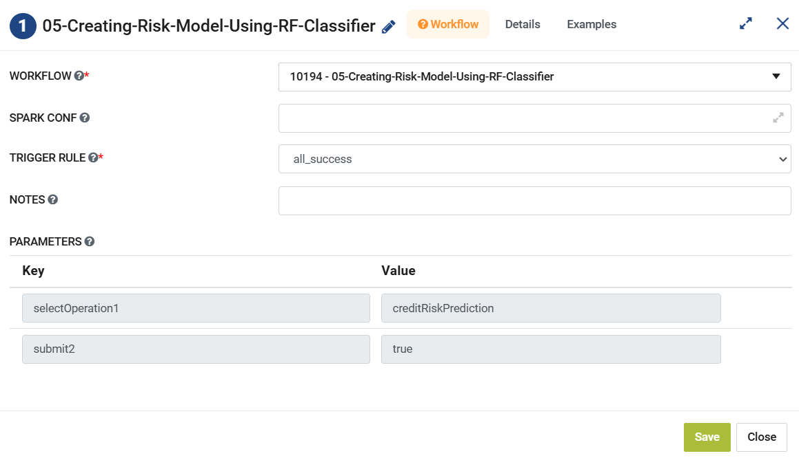

Configure Workflow Node
=====================

This document explains the steps required to configure a **Workflow Node** in a Pipeline.

A **Workflow Node** in a **Pipeline** can be configured as below 

**Workflow:** Select a workflow from the the dropdown. This workflow would be triggered on execution of the node.

**Spark Conf:** Enter **Spark Config** value that needs to be used during the workflow execution. It can be set separately for each workflow. 

	::
		--executor-memory 2g --executor-cores 2 --driver-memory 2g

**Trigger Rule:** This value decides whether to execute the node or not. Select a value from the dropdown. 

	- Select **always** if this node is to be executed irrespective of the completion status of the previous node. 
	- Select **all_success** if node is to be executed only if previous node completed successfully.

**Notes:** Enter notes for the node.

**Parameters:** This section displays all the **Workflow Parameters** defined and set in the workflow.
