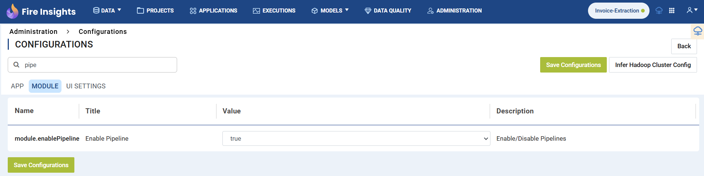
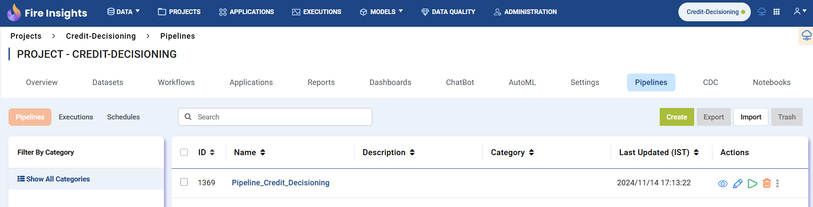
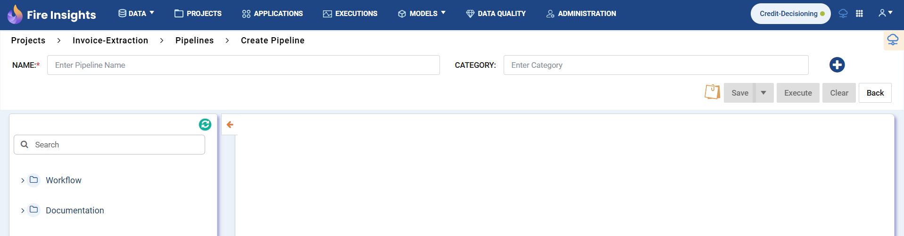
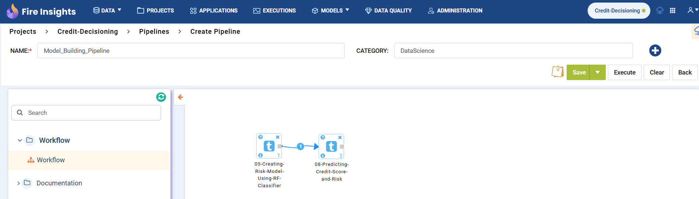

Create Sparkflows Pipeline
=====================

This document explains the steps required to create a pipeline in Sparkflows.

Step 1 : Enable Pipeline
----------------------------------------

* Navigate to **Administration**>**Configuration** after login into the Sparkflows.
* Navigate to the **Module** tab.
* Set **Enable Pipeline** to **True** as below 

* **Pipeline** Tab would be enabled in **Project Dashboard** as below

Step 2 : Pipeline Creation
-------------------------------------

* Navigate to the **Pipeline Tab** on a Project Dashboard.
* Click on the **Create** Pipeline button.
* **New Pipeline** Canvas would be displayed as below.

Step 3 : Add Workflow Nodes to the Pipeline
-----------------------------------------

* Enter an appropriate **Name** and **Category** of the Pipeline.
* Click on the **Workflow Node** from the **Left Pane** to add it the **Pipeline Canvas**.
* In the **Workflow Node** select a workflow from the list. This workflow would be executed on the execution of this node.
* Click on the **Save** Button to save the Pipeline.
* Multiple Workflow Nodes can be added and they can be connected using connector as below.

