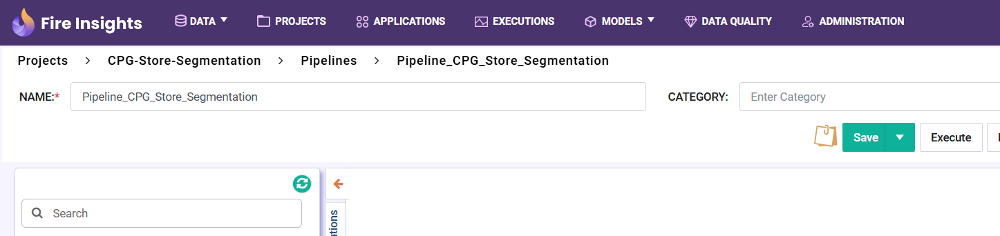
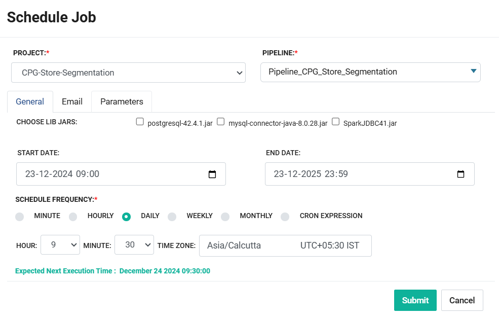

Sparkflows Pipeline - CPG Store Segmenatation
=================================

This tutorial will cover how to use Sparkflows Pipeline to automate CPG Store Segmenatation processing. 

The aim of this tutorial is to create a pipeline encompassing steps like Performing Invoice Data Exploration, Data Cleaning, Data Preparation and Store Segmentation.

Objective of CPG Store Segmentation project is grade Stores based on the various attributes such sales, kind of products they sell, and so on.

It uses synthetic data prepared in-house.  

.. contents::
   :depth: 2

Dataset Creation
-------------------

The below two datasets have been used in the Tutorial. They have been created on top of in-house synthetic data: 

* Customer Invoice: It contains invoices generated by various Customers over a period of time.
* Product Mapping: It contains the mapping information between the Product and its Parent.

   .. figure:: ../../_assets/tutorials/pipeline/pipeline-tutorials-cs-datasets.png
      :alt: pipeline-tutorials
      :width: 70%

Customer Invoice
^^^^^^^^^^^^^^^^^^^^^^^^

Customer Invoice Dataset has following columns. 

   .. figure:: ../../_assets/tutorials/pipeline/pipeline-tutorials-cs-invoiceds.png
      :alt: pipeline-tutorials
      :width: 70%
	  
Product Mapping
^^^^^^^^^^^^^^^^^^^^^^^^

Product Mapping Dataset has following columns.
	  
   .. figure:: ../../_assets/tutorials/pipeline/pipeline-tutorials-cs-prdmappingds.png
      :alt: pipeline-tutorials
      :width: 70%

Workflows Overview
-------------------

The below set workflows are used in the Store Segmentation Project: 

Exploratory Data Analysis
^^^^^^^^^^^^^^^^^^^^^^^^

This workflow facilitates performing data analysis on Customer Invoice data. It is implemented as below using various Sparkflows processors.
	  
   .. figure:: ../../_assets/tutorials/pipeline/pipeline-tutorials-cs-edawf.png
      :alt: pipeline-tutorials
      :width: 70%

* It reads data from Customer Invoice Dataset.
* It computes and displays various metrics such as Summary Statistics, Null Values in the dataset, Columns Cardinality and Monthly Invoice Count.

Data Cleaning
^^^^^^^^^^^^^^^^^^^^^^^^

This workflow facilitates performing data cleaning tasks. It is implemented as below using various Sparkflows processors.
	  
   .. figure:: ../../_assets/tutorials/pipeline/pipeline-tutorials-cs-dcwf.png
      :alt: pipeline-tutorials
      :width: 70%

* It reads data from Customer Invoice Dataset.
* It performs data cleaning tasks such as converting string to date values, extracting date parts and saves the cleaned data.
* It joins invoice data with product mapping data.
* Cleaned data from this stage would be used further for processing.

Data Preparation
^^^^^^^^^^^^^^^^^^^^^^^^

This workflow facilitates performing data preparation tasks. It is implemented as below using various Sparkflows processors.
	  
   .. figure:: ../../_assets/tutorials/pipeline/pipeline-tutorials-cs-dpwf.png
      :alt: pipeline-tutorials
      :width: 70%

* It reads data Cleaned data saved in the last stage.
* It implements various aggregation techniques to prepare and compute features that would used during segmentation. 
* It computes features such as Avg Monthly Purchases, Avg Invoice Purchases, Count of Unique Products in an Invoice, Total Number of Invoices and so on.
* Prepared Feature data is saved to be used further during Segmentation stage.

Store Segmentation
^^^^^^^^^^^^^^^^^^^^^^^^

This workflow facilitates performing store segmentaion. It is implemented as below using various Sparkflows processors.
	  
   .. figure:: ../../_assets/tutorials/pipeline/pipeline-tutorials-cs-sswf.png
      :alt: pipeline-tutorials
      :width: 70%

* It reads data Features data saved in the last stage.
* It implements k-means clustering algorithm for Store Segmentation. 

Pipeline Overview
-------------------

**Pipeline** helps in orchestrating execution of workflows to achieve a business function such as Store Segmentation.

Processing steps pass through the sequence of workflows in a linear manner. Fire Insights provides mechanism to to create, execute and schedule Pipelines. Thus helping in automating executions.

It enhances the implementation experience of Data Engineering, Data Science, CI/CD and various Machine Learning Use Cases. Along with orchestration Pipeline also extend capability of defining parameters in a single window which can be used by the child workflows. It also facilitate to add emails ids which can be notified on success or failure of Pipeline execution.

Pipeline Creation
^^^^^^^^^^^^^^^^^^^^^^^^

Various Store Segmentation workflows are stitched together to create Store Segmentation Pipeline. It is implemented as below using various workflows.
	  
   .. figure:: ../../_assets/tutorials/pipeline/pipeline-tutorials-cs-sspipeline.png
      :alt: pipeline-tutorials
      :width: 70%

* It executes all the workflows sequentially as per the definition.
* It is advisable to add workflows as per the business processing steps.

Addition of Workflows
^^^^^^^^^^^^^^^^^^^^^^^^

Workflows can be added to a Pipeline step using the Workflow Node as below.

   .. figure:: ../../_assets/tutorials/pipeline/pipeline-tutorials-cs-wfnode.png
      :alt: pipeline-tutorials
      :width: 70%

* It executes the mapped workflow.
* All the four workflows need to be added using the Workflow node. They need to be connected using Connector as shown above.

Pipeline Execution And Scheduling
------------------

A **Sparkflows Pipeline** can be executed in the following two ways:

* Manual Execution
* Triggering using a Pipeline Schedule

Manual Execution
^^^^^^^^^^^^^^^^^^^^^

Click on the **Execute** button to execute the pipeline manually, as shown below. 

* It will execute the Child Workflows in sequence as defined. 
* The execution details can be viewed on the **Pipeline Execution** page.
* It picks up the latest data from the datafile for processing.

Triggering using a Pipeline Schedule
^^^^^^^^^^^^^^^^^^^^^

A **Sparkflows Pipeline** can also be triggered at a specified time interval based on the defined **Pipeline Schedule**.

If suppose updated Invoice data is received everyday at 09:00 am in the morning. This pipeline can be scheduled to execute everyday at 09:30 am so that, Store Segmentation is performed everyday on the latest data.

Store Segmentation Pipeline can be scheduled as shown below. 

* It will execute the execute the pipeline everyday at 9:30 am.
* It executes all the workflows in sequence using the new data. 

