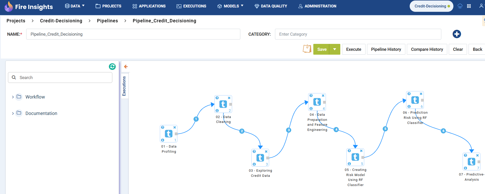
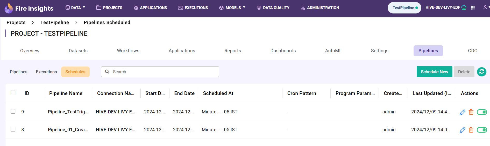

Pipeline Execution And Scheduling
=====================

This document explains the steps required to execute and schedule a **Sparkflows Pipeline**.

A **Sparkflows Pipeline** can be executed in the following two ways:

* Manual Execution
* Triggering using a Pipeline Schedule

Manual Execution
---------------------------

A **Sparkflows Pipeline** can be executed manually by clicking the **Execute** button, as shown below. 

It will execute the Child Workflows in sequence as defined. The execution details can be viewed on the **Pipeline Execution** page.

Triggering using a Pipeline Schedule
---------------------------

A **Sparkflows Pipeline** can also be triggered at a specified time interval based on the defined **Pipeline Schedule**.

A **Pipeline Schedule** can be defined for an individual pipeline. All **Pipeline Schedules** defined in a Project can be viewed as shown below:

Creating a New Pipeline Schedule
---------------------------

To create a new **Pipeline Schedule** follow the steps below:

Step 1: Creating a Schedule for a Sparkflows Pipeline
++++++++++++++

#. Go to **Pipelines** -> **Schedules** page.
  
#. To create a **New Schedule**, click the **Schedule New** button at the right corner below the **Pipelines** tab, as shown below:
  
   .. figure:: ../../_assets/tutorials/pipeline/pipeline-tutorials-schedulenew.png
      :alt: Pipeline Tutorials
      :width: 60%

   After clicking the "Schedule New" button, a page will appear where you can define the new schedule as shown below.

   .. figure:: ../../_assets/tutorials/pipeline/pipeline-tutorials-scheduledef.png
      :alt: Pipeline Tutorials
      :width: 60%

Step 2: Selecting a Pipeline
++++++++++++++++
  
#. Select a **Pipeline** from the dropdown for which the schedule needs to be created.

   .. figure:: ../../_assets/tutorials/pipeline/pipeline-tutorials-scheduledef.png
      :alt: Pipeline Tutorials
      :width: 60%

Step 3: Entering the values for other desired fields
++++++++++++++++++++

#. **General**

   **Connection:** Select a connection from the dropdown. This Connection will be used for Job Execution.

   **Start Date:** Select a start date using the **Calendar** widget. The pipeline execution will begin from the selected date based on the defined schedule. 

   **End Date:** Select an end date using the **Calendar** widget. The pipeline execution will stop on or before the selected date, according to the defined schedule.
  

   **Schedule Frequency:** Select the time interval at which the pipeline is expected to execute between the start and end dates.  

#. **Email**

   .. figure:: ../../_assets/tutorials/pipeline/pipeline-tutorials-scheduleemail.png
     :alt: Pipeline Tutorials
     :width: 60%

   **Email On Success:** Enter a list of email IDs to be notified upon the successful completion of the Pipeline.

   **Email On Failure:** Enter a list of email IDs to be notified if the Pipeline Execution fails.

#. **Parameters**

   Enter the **Parameters** in **Key-Value** pairs and click on **Submit** button. These **Parameters** will be used during Pipeline execution.

   .. figure:: ../../_assets/tutorials/pipeline/pipeline-tutorials-execparam.png
     :alt: Pipeline Tutorials
     :width: 60%

Pipeline Execution Status
---------------------------

To view the pipeline execution status, follow these steps:

#. Navigate to **Pipelines > Executions**.
#. The **execution status** of your pipeline will be displayed on the page shown below.

   .. figure:: ../../_assets/tutorials/pipeline/pipeline-tutorials-execstatus.png
      :alt: Pipeline Tutorials
      :width: 60%

   **Launched:** It can be used to identify how a **Pipeline** has been executed - either **Manually** or using **Scheduler**.

#. Click on the **Pipeline Name** to view the execution status of individual workflows as shown below.

   .. figure:: ../../_assets/tutorials/pipeline/pipeline-tutorials-wfexecstatus.png
      :alt: Pipeline Tutorials
      :width: 60%
