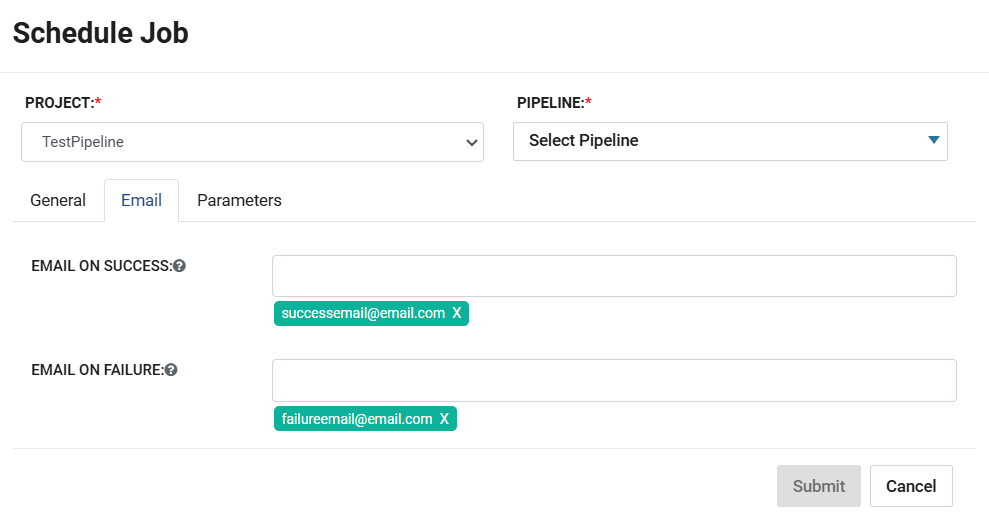
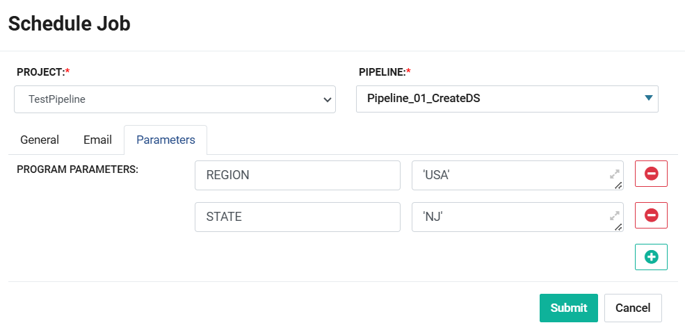
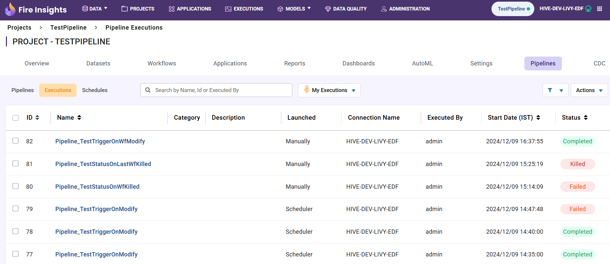
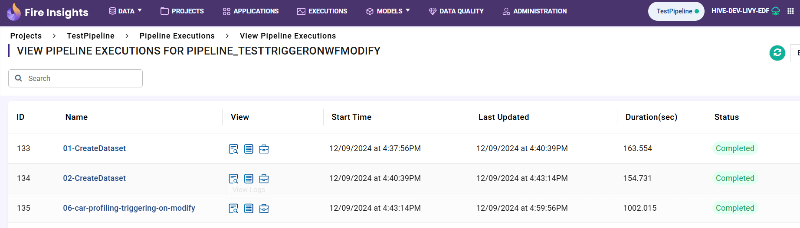

Pipeline Execution And Scheduling
=====================

This document explains the steps required to execute and schedule a **Sparkflows Pipeline**.

A **Sparkflows Pipeline** can be executed in below two ways:

* Manual Execution
* Triggering using a Pipeline Schedule

Manual Execution
---------------------------

A **Sparkflows Pipeline** can be executed manually by click of **Execute** Button as below. 

It would execute the Child Worflows in sequence as defined. Execution details can be viewed in the Pipeline Execution page.

.. figure:: ../../_assets/tutorials/pipeline/pipeline-tutorials-manualexec.png
   :alt: Pipeline Tutorials
   :width: 60%

Triggering using a Pipeline Schedule
---------------------------

A **Sparkflow Pipeline** can also be triggered at a given time interval as per the defined **Pipeline Schedule**

A **Pipeline Schedule** can be defined for an individual **Pipeline**. All **Pipeline Schedule** defined in a Project can be viewed as below:

.. figure:: ../../_assets/tutorials/pipeline/pipeline-tutorials-scheduleslist.png
   :alt: Pipeline Tutorials
   :width: 60%

Creating a new Pipeline Schedule
---------------------------

To create a new **Pipeline Schedule** follow below steps:

* **Step 1**

  A **Schedule** can be created for a **Sparkflows Pipeline**. 
  
  To create a **New Schedule** click on **Schedule New** Button in the **Pipelines** -> **Schedules** page as below:
  
  .. figure:: ../../_assets/tutorials/pipeline/pipeline-tutorials-schedulenew.png
     :alt: Pipeline Tutorials
     :width: 60%

* **Step 2**

  On clicking **New Schedule** Button page to define a new schedule appears as below:
  
  .. figure:: ../../_assets/tutorials/pipeline/pipeline-tutorials-scheduledef.png
     :alt: Pipeline Tutorials
     :width: 60%
  
  **Pipeline:** Select a **Pipeline** from the dropdown for which **Schedule** is to be created.

General
^^^^^^^

**Connection:** Select a **Connection** from the dropdown. It would be used for Job Execution.

**Start Date:** Select a **Start Date** using the **Calendar** widget. Execution of Pipeline would start from the selected value as per the schedule defined.

**End Date:** Select a **End Date** using the **Calendar** widget. Execution of Pipeline would stop at or before the selected value as per the schedule defined.

**Schedule Frequency:** Select a time interval when Pipeline is expected to be executed between the **Start** and **End** Values. 

Email
^^^^^

**Email On Success:** Enter a list of email ids that need to be notified on successful completion of the Pipeline.

**Email On Failure:** Enter a list of email ids that need to be notified on failure of the Pipeline.

Parameters
^^^^^

**Parameters:** Enter **Parameters** in **Key-Value** pairs. These **Parameters** would be used during Pipeline execution.

Pipeline Execution Status
---------------------------

**Pipeline Execution Status** can be viewed as below by navigating to **Pipelines > Executions**:

**Launched:** It can be used to identify how a **Pipeline** has been executed whether **Manually** or using **Scheduler**.

* Click on the **Pipeline Name** to view the execution status of individual Workflows as below:

