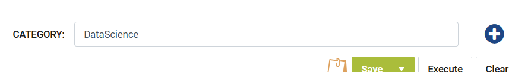
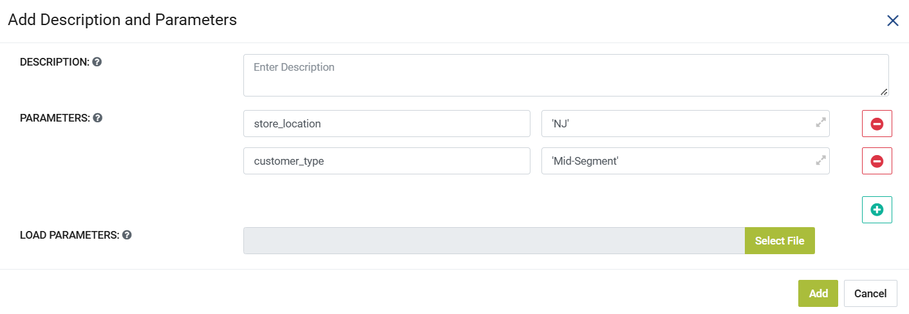

Pipeline Parameters
=====================

This document explains the steps required to define **Parameters** in a Pipeline.

* Click on **Add**/**Plus** icon next to the **Category** field in a Pipeline 

* **Add Parameters** pop-up would be displayed as below:

* Add **Parameters** in **Key-Value** pairs.
* Click on **Add** Button to save Parameters.

.. note:: Parameters added to a Pipeline are accessible in the Child Workflows. They can be accessed using syntax **${param_name}**
