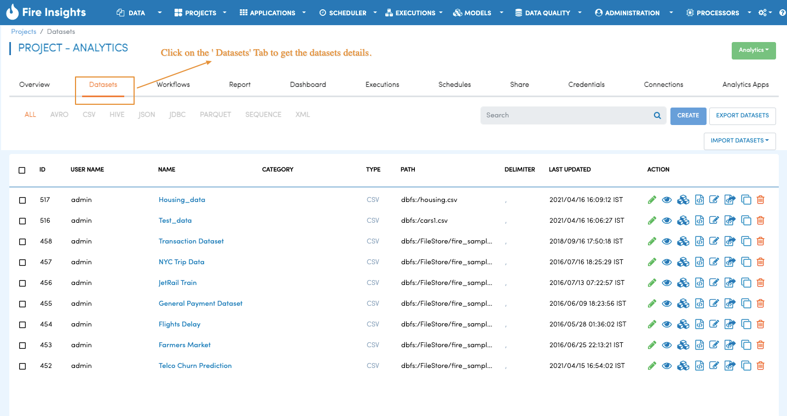
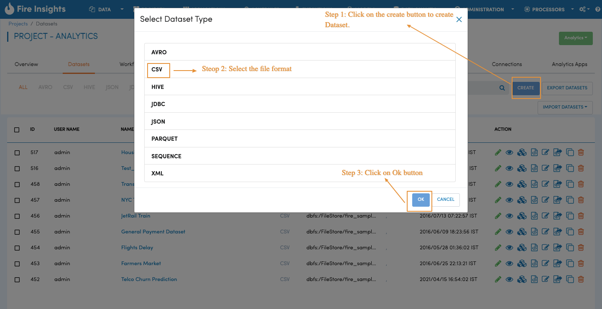
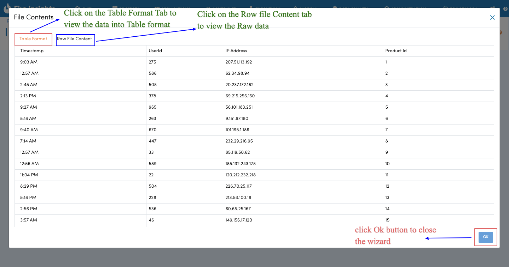
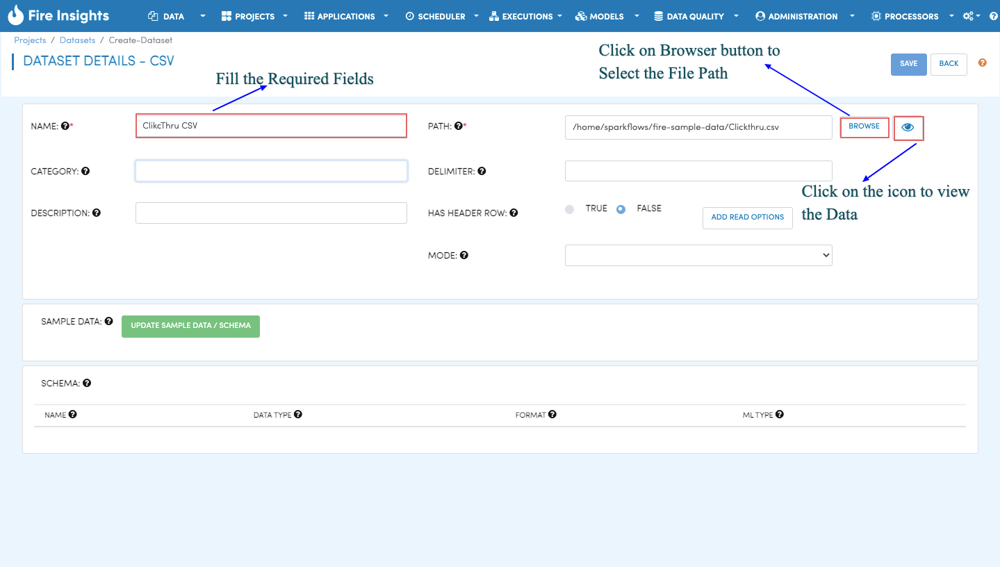
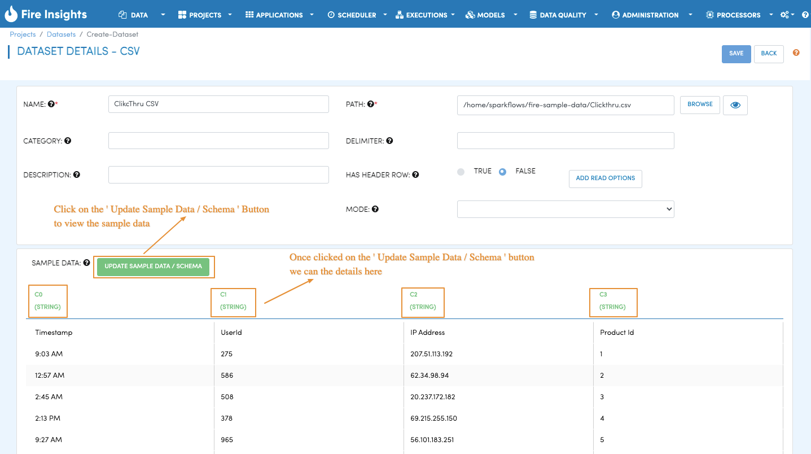
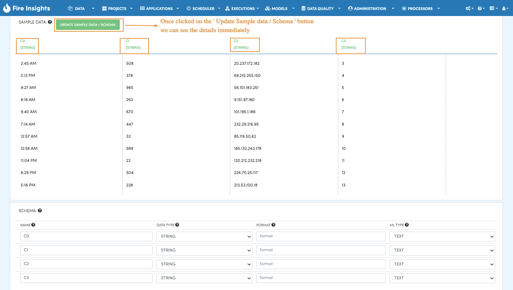
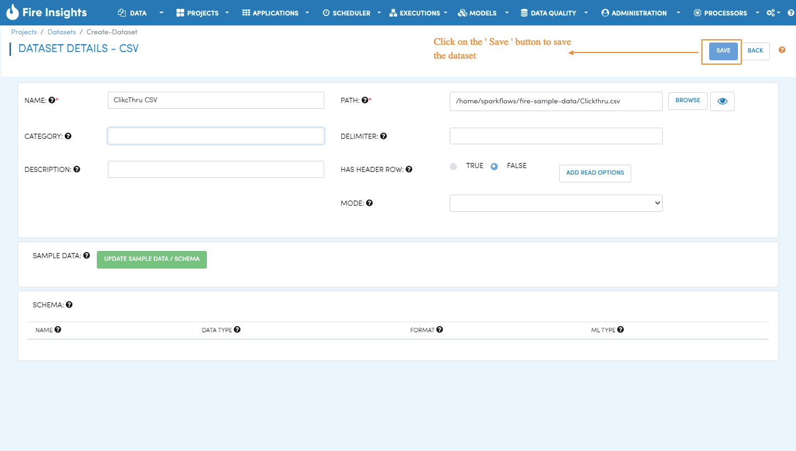
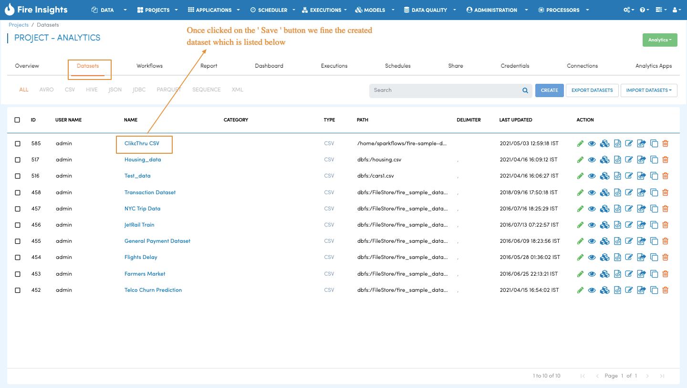

Create Dataset on CSV Files
=================

When working with data in Fire Insights, the first step is to create a dataset that you plan to process subsequently. Dataset is a wrapper around your data which makes it easy to handle it in Sparkflows workbench.

When datasets are created, Fire Insights automatically infers the schema using Spark-CSV library from Databricks.

Datasets List
--------

When you open any application, all existing datasets specific to the application are displayed in the Datasets tab.



   
Dataset Creation
----------------
 
**Choose type of Dataset to Create**

Navigate to the ``Datasets`` tab in your application. Click on the ``Create`` button and choose any dataset.
In the pop-up choose ``CSV`` and then click ``OK``.



**Dataset Details**

Clicking ``OK`` will take you to dataset details page where you can enter information about your dataset. In the image given below, we create a dataset from a Clickthru.csv file. It is a comma separated file with a header row specifying the names of the various columns.   



   
For Clickthru.csv file, we will fill in the required fields as below.   



   
We specified a name for the dataset we are creating. ‘Header’ is set to true indicating that the file has a header row, field delimiter is comma and we also specified the path to the file.

**Hit Update Sample data/Schema**

Once we have specified the above, we hit the ``Update Sample data/schema`` button. This brings up the sample data, infers the schema and displays it. We can change the column names and also the data types. Format column is used for specifying the format for date and time fields.







**Save Dataset**

Clicking the ```Save`` button creates the new dataset. The dataset is now ready for use in any workflow within the specific application.


   
You can find your created dataset on dataset list page.
  

