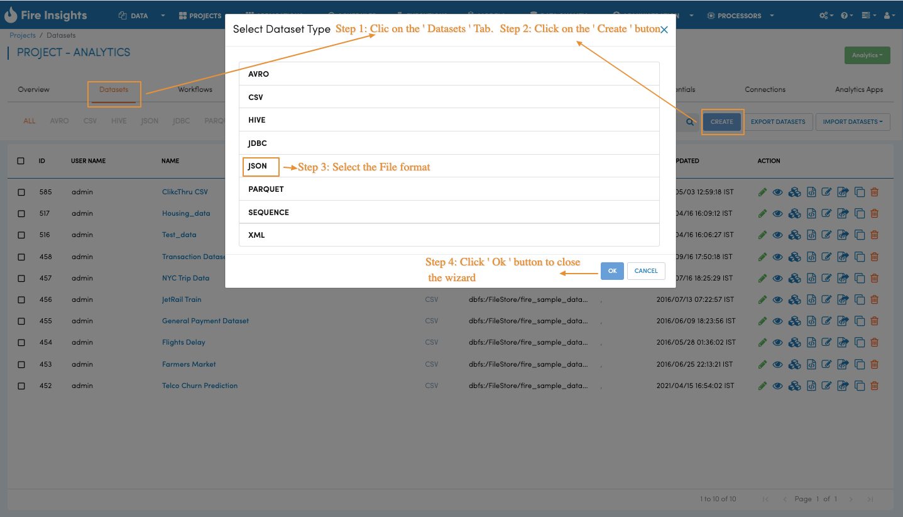
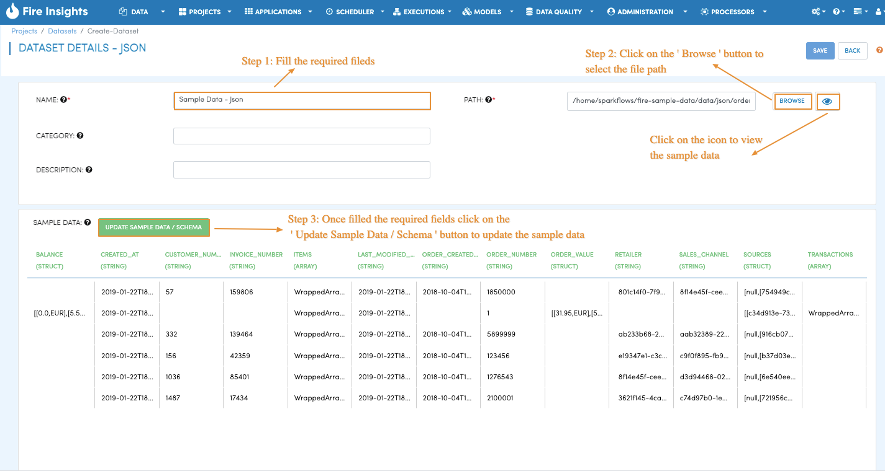
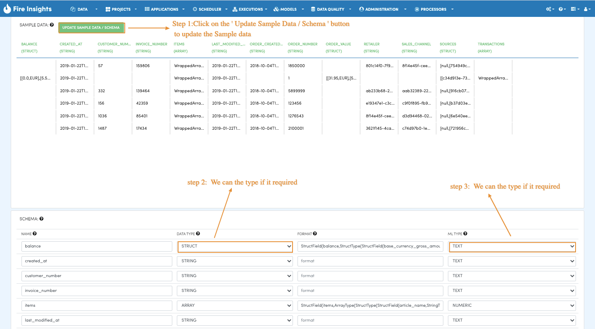
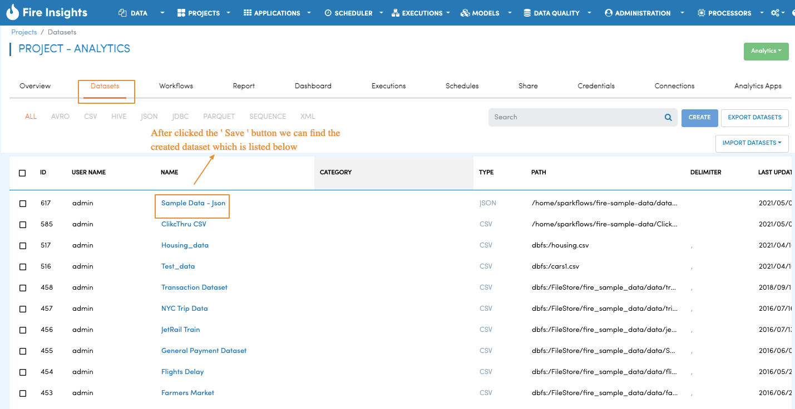

Create Dataset on JSON Files
=================

When working with data in Fire Insights, the first step is to create a dataset that you plan to process subsequently. Dataset is a wrapper around your data which makes it easy to handle it in Sparkflows workbench.

When datasets are created, Fire Insights automatically infers the schema using Spark-JSON library.

Datasets
--------

.. figure:: ../../_assets/tutorials/dataset/DatasetsDetails.png
   :alt: Dataset
   :width: 60%
   
Dataset Creation
----------------

Navigate to the ``Datasets`` tab in your application where you want to create a new dataset. Click on the ``Create`` button and choose Dataset. In the pop-up choose ``JSON`` and then click ``OK``.   

   
Clicking ``OK`` will take you to Dataset Details page where you can enter information about your dataset. In the image given below, we create a dataset from customer.json file.   

We specified a name, category, description & path of JSON file for the dataset we are creating.

Once we have specified the above, we hit the ``Update Sample Data/Schema`` button. This brings up the sample data, infers the schema and displays it. We can change the column names and also the data types. Format column is used for specifying the format for date/time fields.

Clicking the ``Save`` button saves the new JSON dataset. The JSON dataset is now ready for use in any workflow within the specific application.

