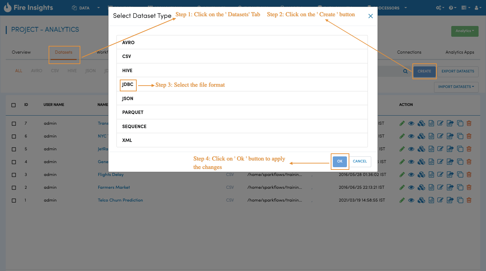
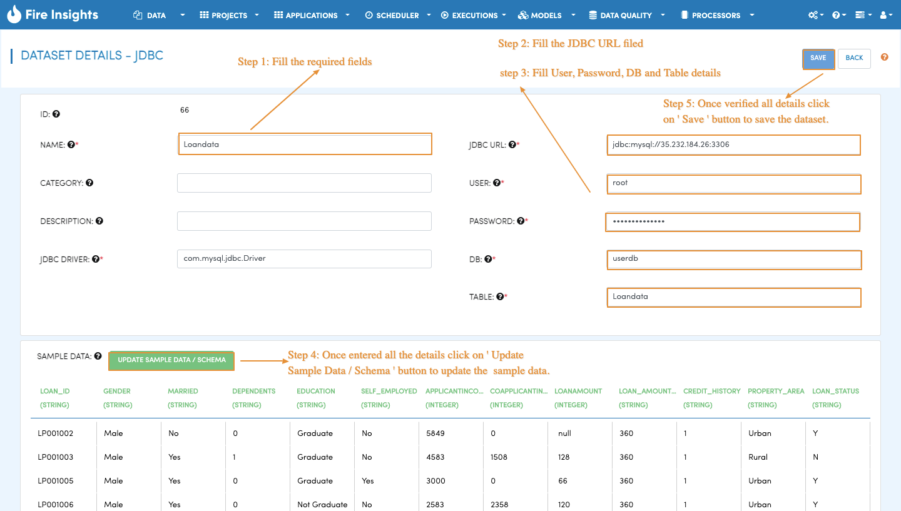
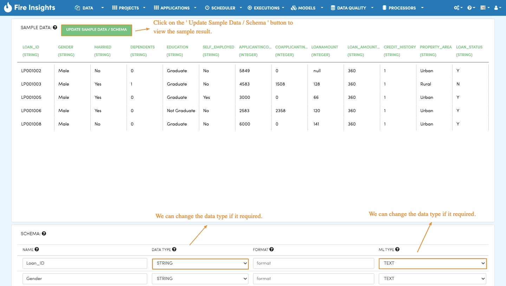
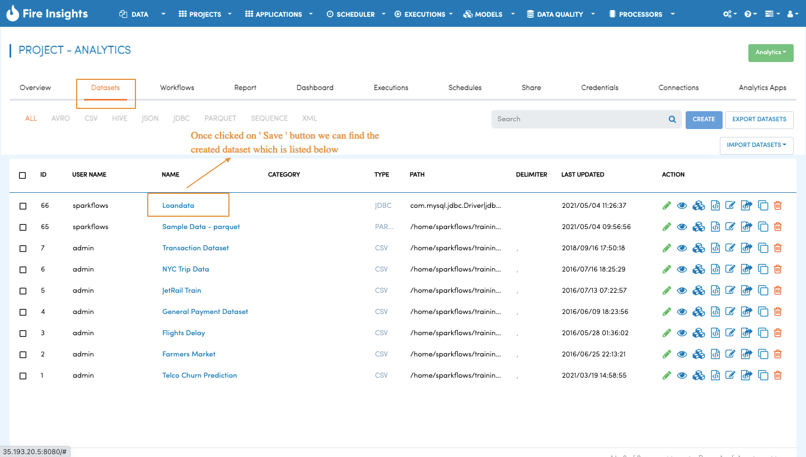

Create Dataset on MySQL Table
============

When working with data in Fire Insights, the first step is to create a dataset that you plan to process subsequently. Dataset is a wrapper around your data which makes it easy to handle it in Sparkflows workbench.

When datasets are created, Fire Insights automatically infers the schema of the dataset.

Datasets
--------

When you open any application, all existing datasets specific to the application are displayed in the Datasets Tab.

.. figure:: ../../_assets/tutorials/dataset/DatasetsDetails.png
   :alt: Dataset
   :width: 60%
      
Dataset Creation
----------------
 
Navigate to the ``Datasets`` tab in your application where you want to create a new dataset. Click on the ``Create`` button and choose Dataset. In the pop-up choose ``JDBC`` and then click ``OK``.

 
 
Specify the name of the dataset you are creating and other required parameters such as JDBC DRIVER, JDBC URL, USER, PASSWORD, DB, TABLE, etc.
 
 
Once you have filled in required information, hit ``Update Sample Data/Schema`` button. This brings up sample data, infers the schema and displays it. You can change column names and data types as needed. Format column is used for specifying the format of date and time fields.

   

Clicking on the ``Save`` button creates the new dataset that can be used in any workflow or interactive dashboard within the specific application.

   
   
