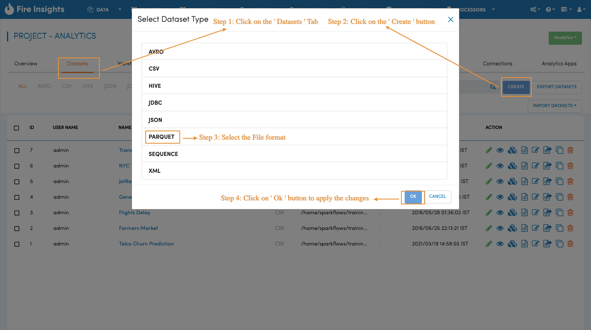
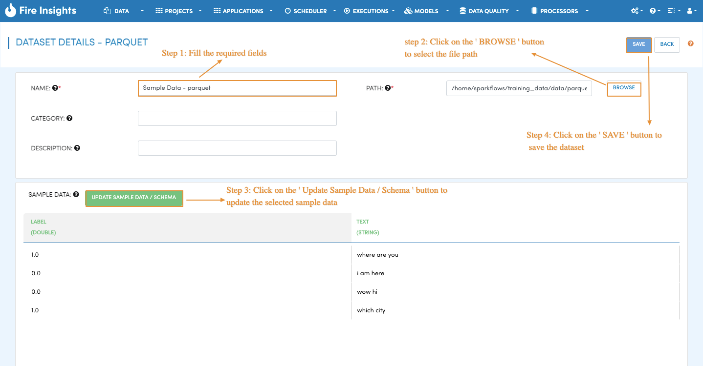
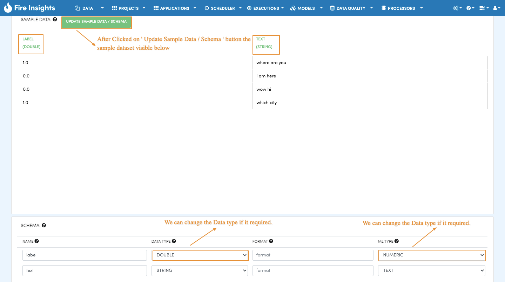
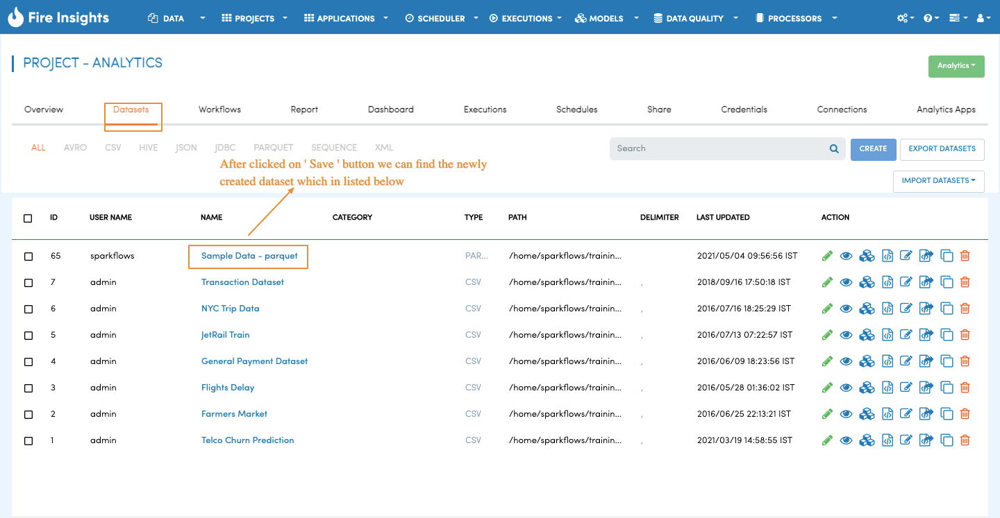

Create Dataset on Parquet Files
=====================

Fire Insights supports reading from several file formats including Parquet files. Parquet files have schema embedded in them. Fire Insights is able to extract schema of Parquet files automatically.

Datasets
--------

The existing datasets are displayed on the Datasets page of specific application.

.. figure:: ../../_assets/tutorials/dataset/DatasetsDetails.png
   :alt: Dataset
   :width: 60%
   
Dataset Creation
----------------

Navigate to the ``Datasets`` tab in your application where you want to create a new dataset. Click on the ``Create`` button and choose the dataset type from the pop-up. It will navigate you to create dataset page of type Parquet. Now, we create a dataset for people.parquet which is a Parquet file.

On the **Create Dataset page**, fill in the required fields as below.

Specify the name of the dataset you are creating.

After specifying name and path, click on the ``Update Sample Data Schema`` button. This brings up the sample data, extracts the schema and displays it. Below, we see that there are 2 fields : Label and Text. Label is of type double and text is of type string.

   
Clicking on the ``Save`` button creates the new Dataset for us.

Now, you are ready to use the dataset in your workflows.
