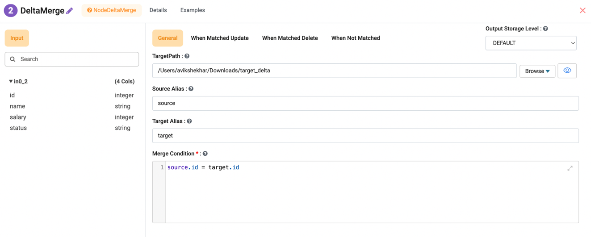
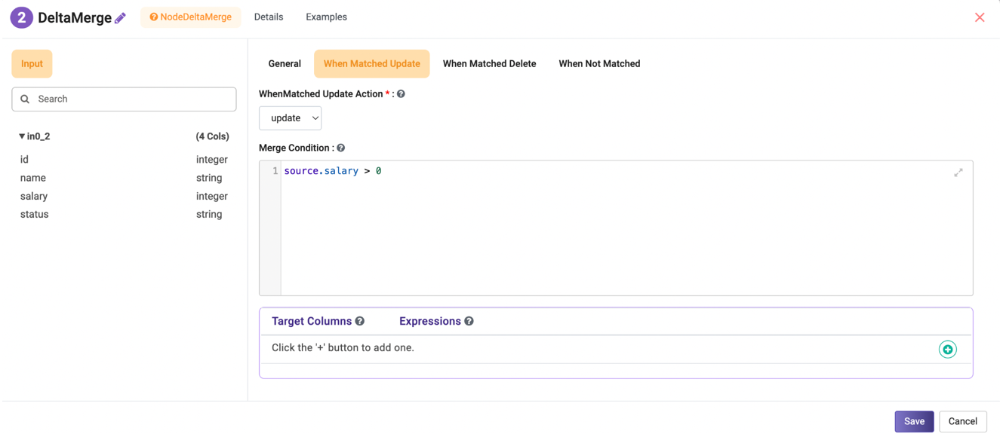
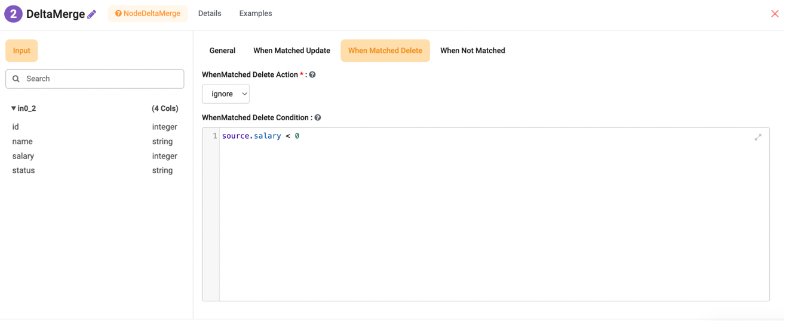
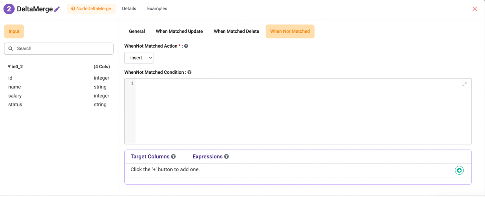

Delta Merge Example
===================

Sparkflows provides no-code/low-code nodes to handle the delta merge. Target path is the location of final delta data.

Example Data
------------

**Target Table**

::

   id,name,salary,status
   1,A,100,active
   2,B,200,active
   3,C,300,active

**Source Data**

::

   id,name,salary
   1,A_updated,150
   2,B,-1
   4,D,400

Business Rule
--------------

After matching (target.id = source.id):

- If salary > 0 --> UPDATE
- If salary <= 0 --> DELETE
- If no match --> INSERT

Node UI Configuration (Your 4 Tabs)
------------------------------

General 
~~~~~~~~~~
  

- **Target Path:** /tmp/delta/employee
- **Source Alias:** source
- **Target Alias:** target
- **Merge Condition:** target.id = source.id

When Matched Update
~~~~~~~~~~~~~~~~~~~~

- **Action:** update
- **Condition:** source.salary > 0

Mapping:

+------------------+------------------+
| Target           | Expression       |
+==================+==================+
| name             | source.name      |
+------------------+------------------+
| salary           | source.salary    |
+------------------+------------------+
| status           | 'active'         |
+------------------+------------------+

When Matched Delete
~~~~~~~~~~~~~~~~~~~~

- **Action:** delete
- **Condition:** source.salary <= 0

When Not Matched 
~~~~~~~~~~~~~~~~~~~

- **Action:** insert
- **Condition:** (empty)

Mapping:

+------------------+------------------+
| Target           | Expression       |
+==================+==================+
| id               | source.id        |
+------------------+------------------+
| name             | source.name      |
+------------------+------------------+
| salary           | source.salary    |
+------------------+------------------+
| status           | 'active'         |
+------------------+------------------+

Final Output
------------

::

   id  name        salary  status
   1   A_updated   150     active
   3   C           300     active
   4   D           400     active
