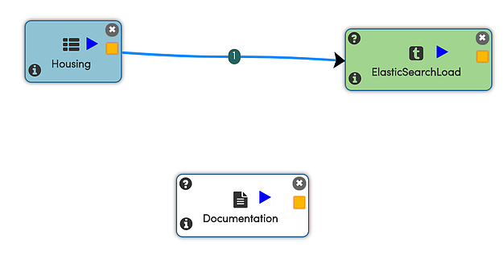
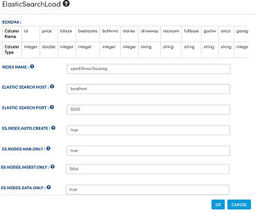
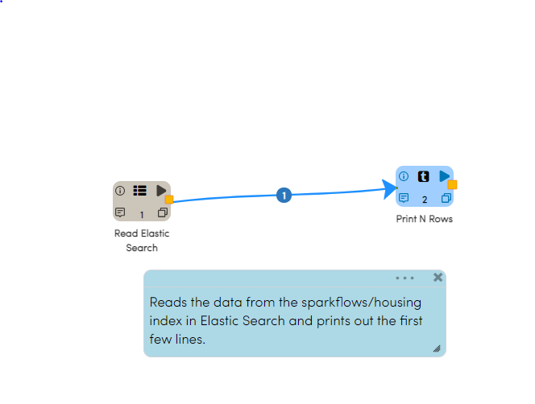
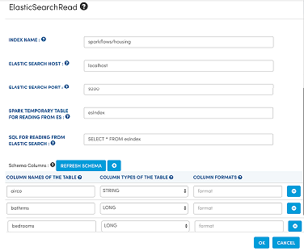

Reading and Writing from ElasticSearch
======================================

Elastic Search is often used for indexing, searching and analyzing datasets. Fire Insights makes it easy to read any data from Elastic Search, clean it and transform it.

Elasticsearch-hadoop provides native integration between Elasticsearch and Apache Spark. In the example below we will first load data from HDFS into Elastic Search and then read it back into Apache Spark from Elastic Search.

If your data is already in Elastic Search skip to "Workflow for Reading data from Elastic Search". 

Workflow for Loading data into Elastic Search
----------------------------------------------

The below workflow reads in the Housing Dataset which is in CSV format from HDFS.It then saves the data into Elastic Search.

The Documentation processor is just for documentation purposes.

In the above workflow, the Node 'ElasticSearchLoad' takes in the incoming data and loads it into the Elastic Search Index 'sparkflows/housing'.

The below diagram shows the dialog box for the Elastic Search Load Processor.

   
Workflow Execution
------------------

When we execute the Workflow, it reads in the dataset from HDFS and loads it into Elastic Search.

.. figure:: ../../_assets/tutorials/dataset/20.PNG
   :alt: Dataset
   :align: center
   :width: 60%

Workflow for Reading data from Elastic Search
---------------------------------------------

The below workflow reads the data from the sparkflows/housing index in Elastic Search and prints out the first few lines.

 
In the above workflow, the Node 'ElasticSearchRead' reads in the records from the Elastic Search Index 'sparkflows/housing'.

The below diagram shows the dialog box for the Elastic Search Read Processor.

   
In the above dialog, the 'Refresh Schema' button infers the schema of the index. Thus it is able to pass down the output schema to the next Processor making it easy for us to build the workflow.

SQL specifies the SQL to be used for reading from Elastic Search. It allows us to limit the columns of interest, where clauses etc.

The Elastic Search Spark connector understands the SQL and translates it into the appropriate QueryDSL. The connector pushes down the operations directly at the source, where the data is efficiently filtered out so that only the required data is streamed back to Spark. This significantly increases the query performance and minimizes the CPU, memory and I/O operations on both Spark and Elastic Search clusters.

Workflow Execution
------------------

When we execute the Workflow, it reads in the index from Elastic Search and displays the first few lines.

We see that the housing records we wrote to Elastic Search in the first workflow is read back now.

.. figure:: ../../_assets/tutorials/dataset/23.PNG
   :alt: Dataset
   :align: center
   :width: 60%

   
   
   
   
