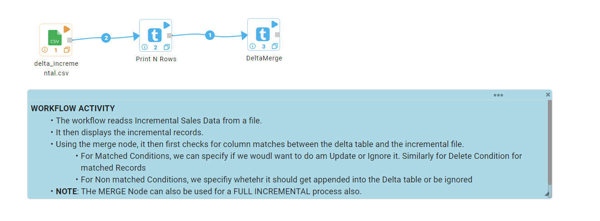
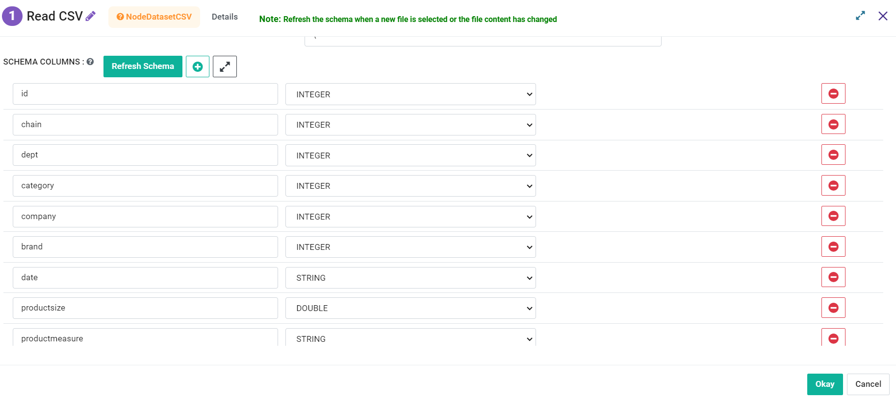
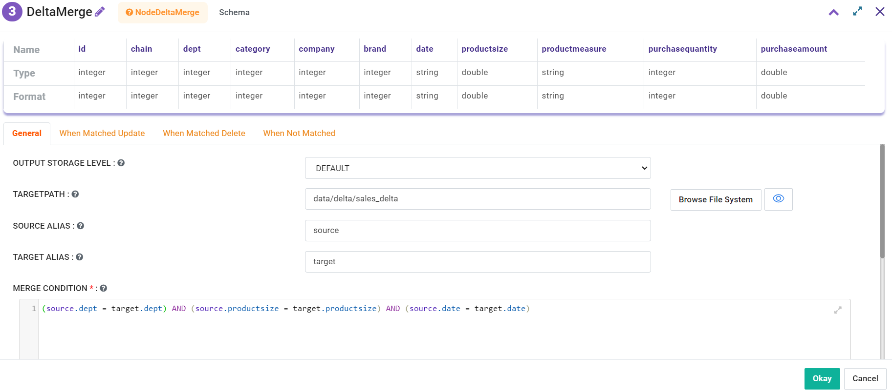
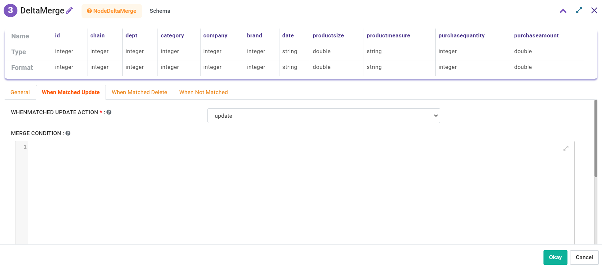
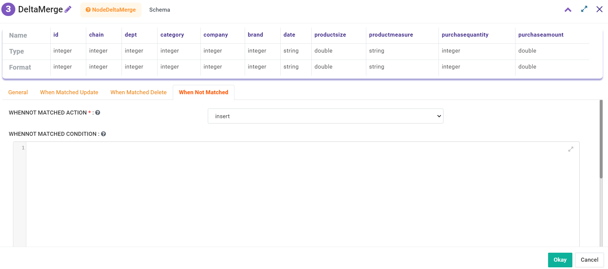
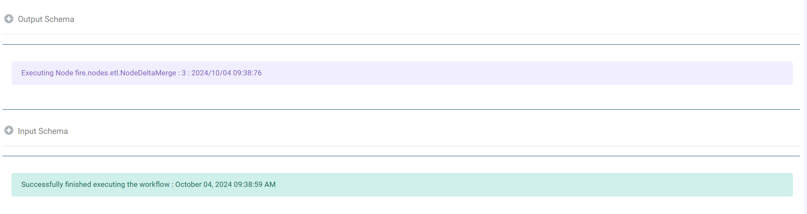

Using Merge Write Option to Write to Delta Lake
===============================================

Fire Insights also provides the option to write to Delta Lake using the Merge write operation. This approach enables users to handle incremental data and make updates or insertions to the Delta table based on specified conditions.

Workflow
--------

The following workflow demonstrates how to use the Merge write option. The steps involved are:

* Reads the Incremental Sales dataset.
* Displays the incremental records.
* Merges the incremental data into the Delta table based on matching conditions.

Reads Incremental Sales Dataset
---------------------

This step reads the incremental sales data from a source file.

Processor configuration
^^^^^^^^^^^^^^^^^^

   
Processor output
^^^^^^

.. figure:: ../../_assets/user-guide/read-write/merge-delta/display-incremental-output.png
   :alt: display-incremental-output
   :width: 60%

Merge Data into Delta Table
----------------

This step merges the incremental data into the Delta table using the merge operation, applying conditions for updates, deletions, or insertions.

Processor configuration
^^^^^^^^^^^^^^^^^^

|

Once the workflow is executed successfully, the incremental data will be merged into the Delta table based on the defined conditions.

