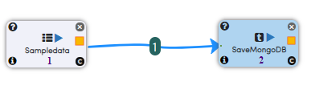
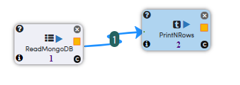

Reading and Writing from MongoDB
================================

MongoDB is a document database with the scalability and flexibility that you want with the querying and indexing that you need, Here we are loading data from HDFS  and Saving it into MongoDB.

Workflow for Loading data into MongoDB
---------------------------------------

The below workflow reads in the Sample Dataset which is in CSV format from HDFS.

It then saves the data into MongoDB.

The below diagram shows the dialog box for the SaveMongoDB Processor.

.. figure:: ../../_assets/tutorials/mongodb/savemongodbprocessor.PNG
   :alt: SaveMongoDB
   :align: center
   :width: 60%
   
Workflow Execution
------------------

When we execute the Workflow, it reads in the dataset from HDFS and loads it into MongoDB.

.. figure:: ../../_assets/tutorials/mongodb/workflowexecutionsavemongodb.PNG
   :alt: SaveMongoDB
   :align: center
   :width: 60%

Workflow for Reading data from MongoDB
---------------------------------------

The below workflow reads Data in MongoDB.

It then Print the data.

The below diagram shows the dialog box for the ReadMongoDB Processor.

.. figure:: ../../_assets/tutorials/mongodb/Readmongodbprocessor.PNG
   :alt: ReadMongoDB
   :align: center
   :width: 60%
   
Workflow Execution
------------------

When we execute the Workflow, it reads in the Sample collection from MongoDB and displays the first few lines.

We see that the Sample data records we wrote to MongoDB in the first workflow is read back now.

.. figure:: ../../_assets/tutorials/mongodb/workflowexecutionreadmongodb.PNG
   :alt: ReadMongoDB
   :align: center
   :width: 60%

