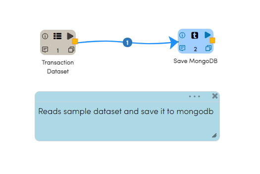
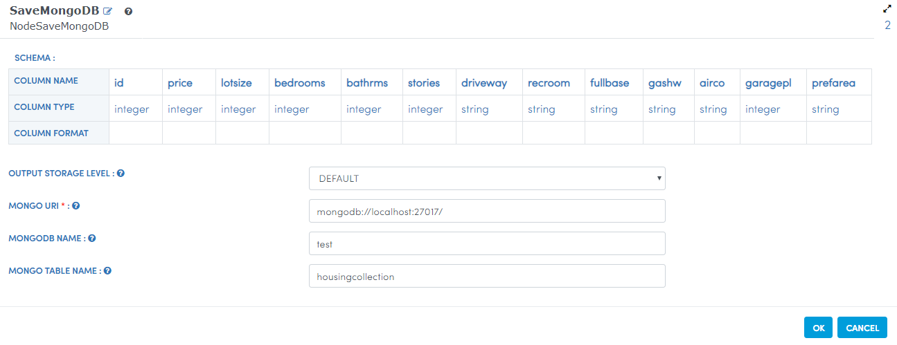

Reading and Writing from MongoDB
================================

MongoDB is a document database with the scalability and flexibility that you want with the querying and indexing that you need, Here we are loading data from HDFS  and Saving it into MongoDB.

Workflow for Loading data into MongoDB
---------------------------------------

The below workflow reads in the Housing Dataset which is in CSV format from HDFS.

It then saves the data into MongoDB.

The below diagram shows the dialog box for the SaveMongoDB Processor.

