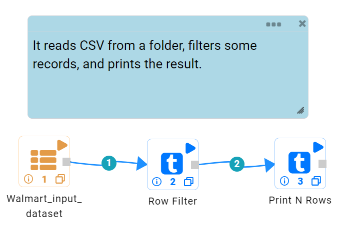
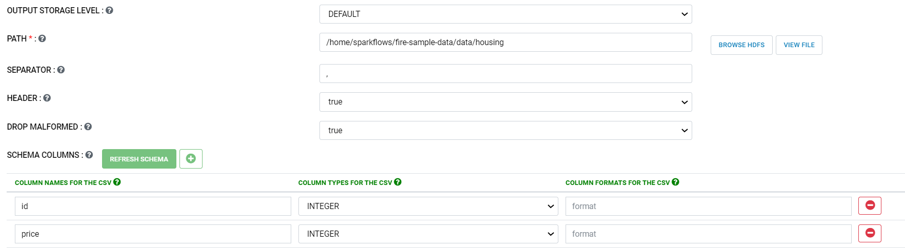
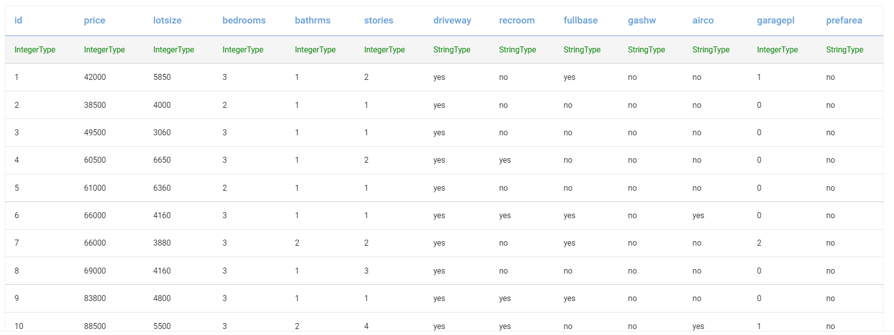
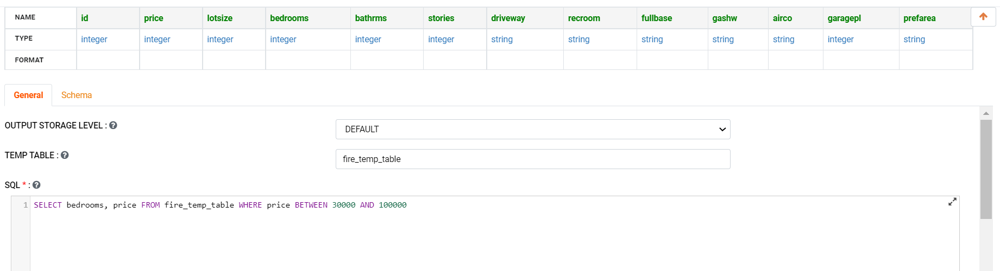
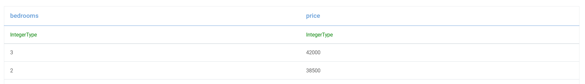
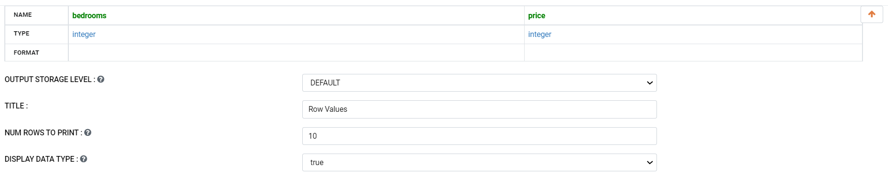
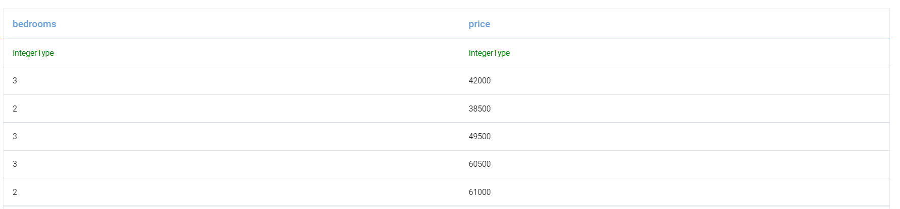

Processing Multiple Files
=========================

This workflow reads in multiple files available in a specific directory. It then filters and calculates the number of bedrooms with specific prices and then prints the results.

Workflow
-------

Below is the workflow. It does the following:

* Reads multiple CSV files available in a specific directory.
* Filters it to calculate the number of bedrooms with specific prices.
* Prints the results.

   
Reading CSV files
---------------------

It reads multiple CSV files available in a specific directory using the ReadCSV processor.

Processor Configuration
^^^^^^^^^^^^^^^^^^

Processor Output
^^^^^^

Filter its data
----------------

It then filters to calculate the number of bedrooms with specific prices using an SQL processor.

Processor Configuration
^^^^^^^^^^^^^^^^^^

   
Processor Output
^^^^^^

   
Print the results
------------------

It will print the results with the output required after filter aggregation.

Processor Configuration
^^^^^^^^^^^^^^^^^^

   
Processor Output
^^^^^^

