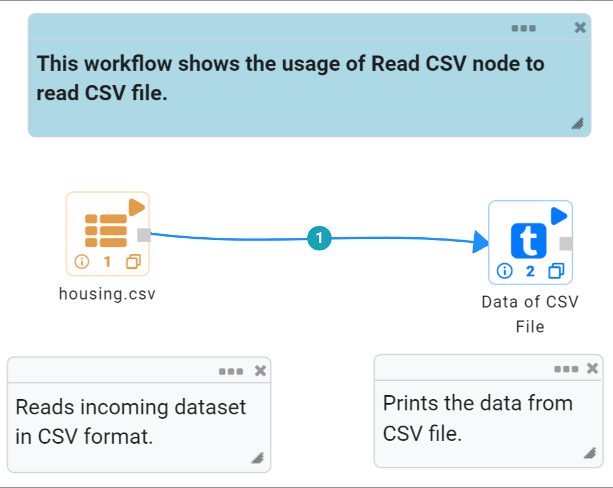
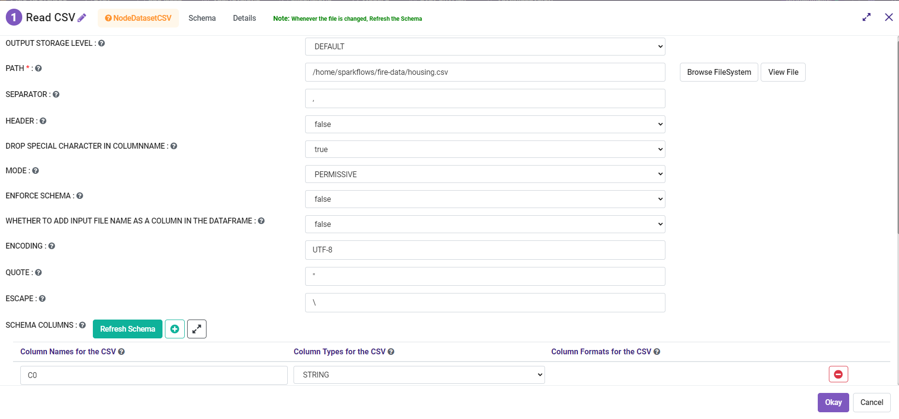
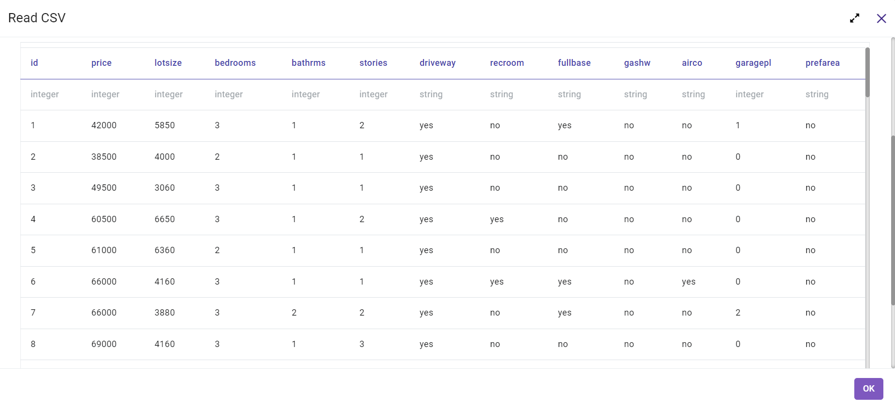

Read CSV Files
=================

Fire Insights enables you to read CSV files.

Workflow
--------

The below workflow does the following:

* Reads data from a CSV file.
* Prints a few records of the DataFrame.

Reading from CSV File
---------------------

It reads data from a CSV File using Read CSV processor.

* **PATH** : Path of CSV file.
* **SEPARATOR** : CSV separator.
* **HEADER** : Whether the CSV file has a header line.
* **DROP SPECIAL CHARACTER IN COLUMNNAME** : Whether to drop the special characters and spaces in column name.
* **MODE** : Mode for dealing with corrupt records during parsing.
* **ENFORCE SCHEMA** : If it is set to true, the specified or inferred schema will be forcibly applied to datasource files, and headers in CSV files will be ignored. If the option is set to false, the schema will be validated against all headers in CSV files in the case when the header option is set to true.
* **WHETHER TO ADD INPUT FILE NAME AS A COLUMN IN THE DATAFRAME**: Add the new field:input_file_name.
* **ENCODING** : Decodes the CSV files by the given encoding type.
* **QUOTE** : Sets a single character used for escaping quoted values where the separator can be part of the value.
* **ESCAPE** : Sets a single character used for escaping quotes inside an already quoted value.

Processor Configuration
^^^^^^^^^^^^^^^^^^

   
Processor Output
^^^^^^

Prints the Results
------------------

It prints the first few records of the DataFrame.
