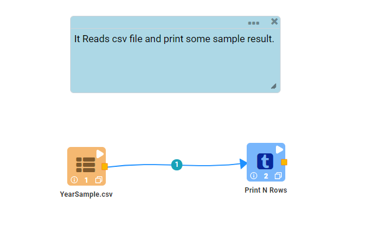
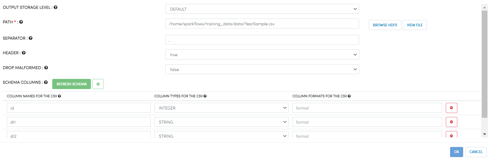

Reading CSV Files
=================

Fire Insights enables you to Read CSV files.

Workflow
--------

The below workflow does the following:

* Reads data from a CSV file
* Prints a few records of the dataframe

Reading from CSV File
---------------------

It reads data from a CSV File using Read CSV processor.

* PATH : Path of csv file
* SEPARATOR : CSV separator
* HEADER : Whether the CSV file has a header line
* DROP MALFORMED : Whether malformed records would be dropped or an error raised

Processor Configuration
^^^^^^^^^^^^^^^^^^

   
Processor Output
^^^^^^

.. figure:: ../../_assets/user-guide/read-write/3.png
   :alt: readwrite
   :width: 60%

Prints the Results
------------------

It prints the first few records of the dataframe
