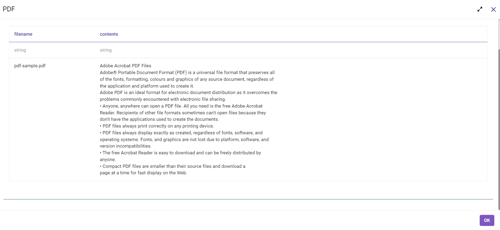

Read PDF Files
=============

This workflow reads PDF file from the given location. It then parses its content, creates DataFrame and then prints the result.

Workflow
-------

The below workflow:

* Reads PDF file from the given location and creates DataFrame from it.
* Prints the result.

.. figure:: ../../_assets/tutorials/read-write/read-pdf-file/pdf-wf.png
   :alt: ReadandParse
   :width: 60%
   
Reading And Parsing PDF File
---------------------

``PDF`` processor uses the passed location to download PDF file, parse its content into string and creates the DataFrame.

Processor Configuration
^^^^^^^^^^^^^^^^^^

.. figure:: ../../_assets/tutorials/read-write/read-pdf-file/pdf-config.png
   :alt: ReadandParse
   :width: 60%

  
Processor Output
^^^^^^

   
   
Prints the Result
------------------

It prints the result onto the screen using Print N Rows processor.
