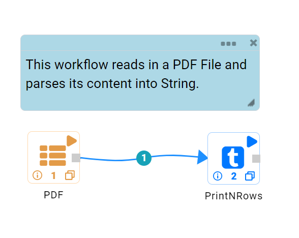
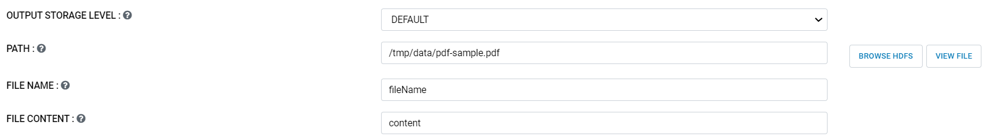
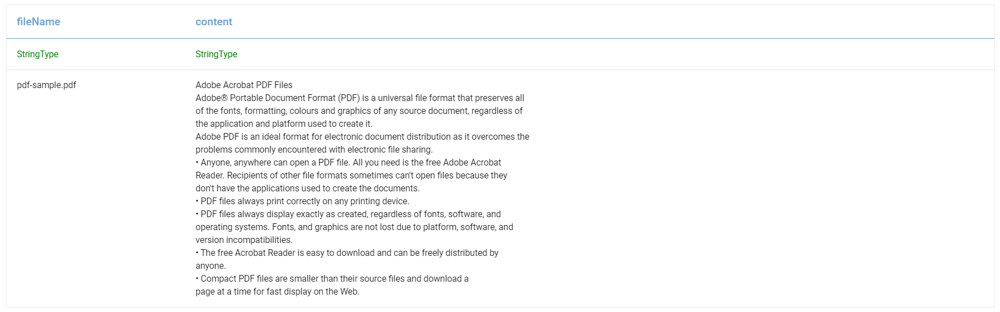

Read PDF Files
=============

This workflow reads PDF file from the given location. It then parses its content, creates dataframe and then prints the result.

Workflow
-------

The below workflow shows:

* Reads PDF file from the given location and create dataframe from it.
* Prints the result.

   
Reading And Parsing PDF File
---------------------

``DatasetPDF`` processor uses the passed location to download PDF file, parse its content into string and create the dataframe.

Processor Configuration
^^^^^^^^^^^^^^^^^^

  
Processor Output
^^^^^^

   
   
Prints the Result
------------------

It prints the result onto the screen.
