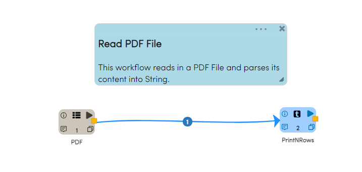
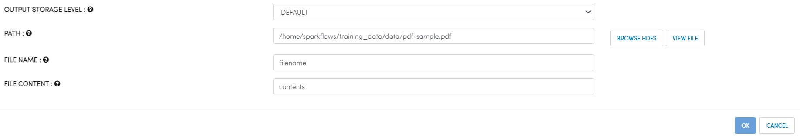
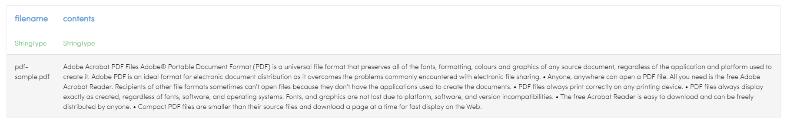

Reading PDF File
=============

This workflow reads PDF file from the given location. It then parses its content, creates DataFrame and then prints the result.

Workflow
-------

The below workflow shows:

* How to read in PDF file from the given location and create the DataFrame from it
* Prints the result

   
Reading And Parsing PDF File
---------------------

``DatasetPDF`` processor uses the passed location to download PDF file, parse its content into string and create the DataFrame.

Processor Configuration
^^^^^^^^^^^^^^^^^^

  
Processor Output
^^^^^^

   
   
Prints the Result
------------------

It prints the result onto the screen.
