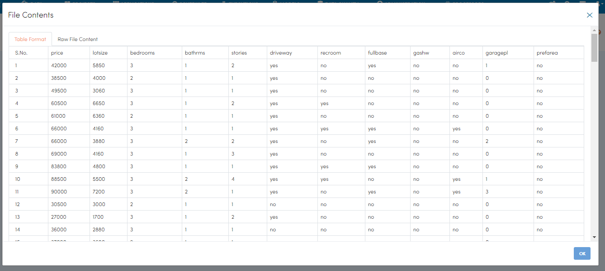
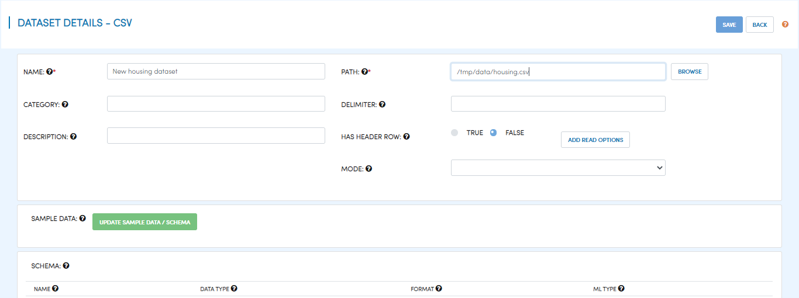
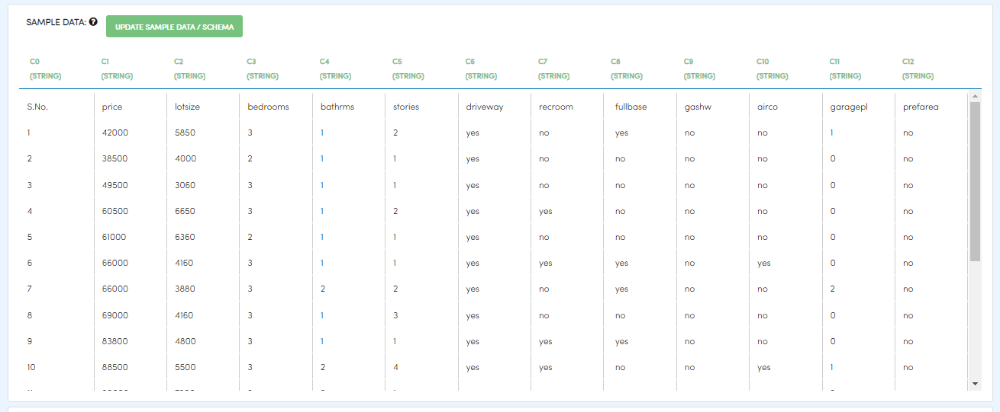
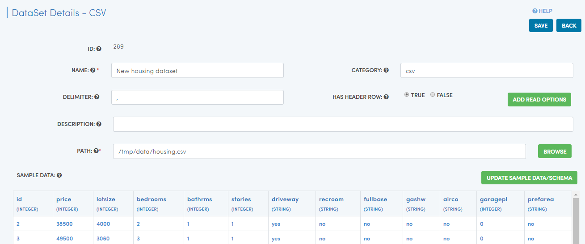
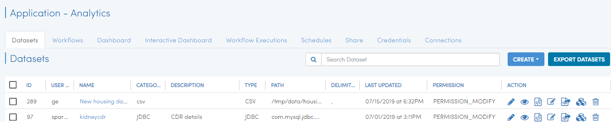

Reading CSV Files
=================

When working with data in Fire Insights, the first step is to create a dataset that you plan to process subsequently. Dataset is a wrapper around your data which makes it easy to handle it in Sparkflows workbench.

When datasets are created, Fire Insights automatically infers the schema using spark-csv library from Databricks.

Datasets
--------

When you open any application, all existing Datasets specific to the application are displayed in the Datasets tab.

.. figure:: ../../_assets/tutorials/dataset/1.PNG
   :alt: Dataset
   :align: center
   :width: 60%
   
Dataset Creation
----------------
 
Navigate to the "Datasets" tab in your application where you want to create a new dataset. Click on the "Create" button and choose "Dataset". In the pop-up choose "CSV" and then click "OK".

.. figure:: ../../_assets/tutorials/dataset/10.PNG
   :alt: Dataset
   :align: center
   :width: 60%

Clicking "OK" will take you Dataset Details page where you can enter information about your dataset. In the screenshot below, we create a dataset from a housing.csv file. It is a comma separated file with a header row specifying the names of the various columns.   

   
For the housing.csv file, we will fill in the required fields as below.   

   
We specified a name for the dataset we are creating. ‘Header’ is set to true indicating that the file has a header row, field delimiter is comma and we also specified the path to the file.

Once we have specified the above, we hit the ‘Update Sample data/schema’ button. This brings up the sample data, infers the schema and displays it. We can change the column names and also the data types. Format column is used for specifying the format for date/time fields.

Clicking the ‘Save’ button creates the new dataset. The dataset is now ready for use in any workflows within the specific application.

   
      
