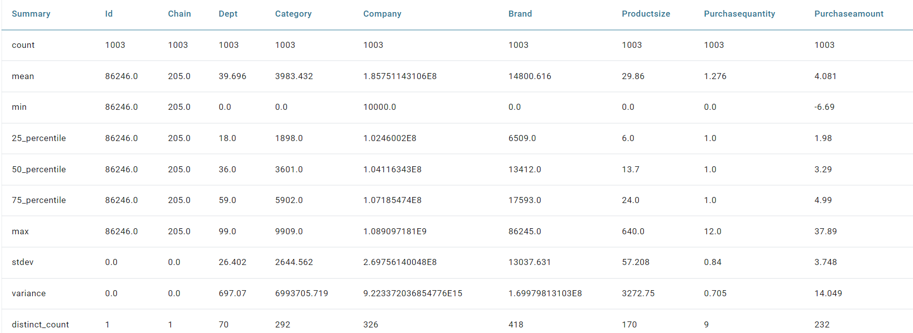

Read From Delta Lake 
================

Fire Insights provides seamless integration with Delta Lake, allowing users to efficiently read and process data stored in Delta Lake tables.

Workflow
--------

Below is the workflow. It does the following:

* Reads data from the Delta Lake path.
* Prints the sample result.
* Prints the summary profile of the data.

.. figure:: ../../_assets/user-guide/read-write/read-delta/read-delta-wf.png
   :alt: read-delta-wf
   :width: 60%

Reading from Delta Lake
---------------------

It reads data from the Delta Lake using the Read Delta processor.

Processor Configuration
^^^^^^^^^^^^^^^^^^

.. figure:: ../../_assets/user-guide/read-write/read-delta/read-delta-processor.png
   :alt: read-delta-processor
   :width: 60%

Prints the Results and the Summary Details 
------------------

It prints the first 20 records using the Print N Rows processor with the Summary Node providing the summary profiling information.

.. figure:: ../../_assets/user-guide/read-write/read-delta/read-delta-output.png
   :alt: read-delta-output
   :width: 60%

