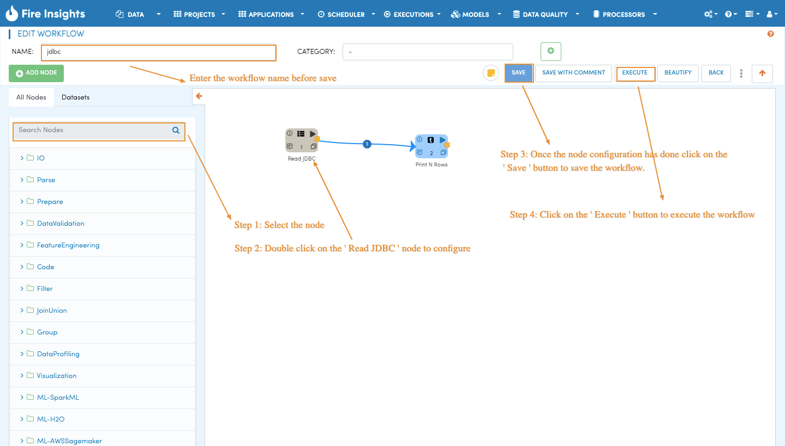
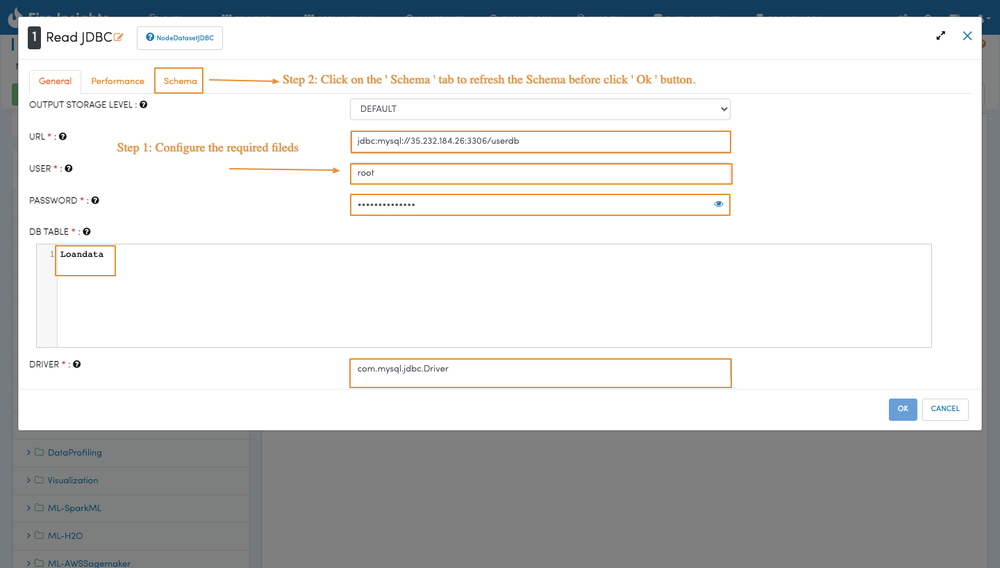
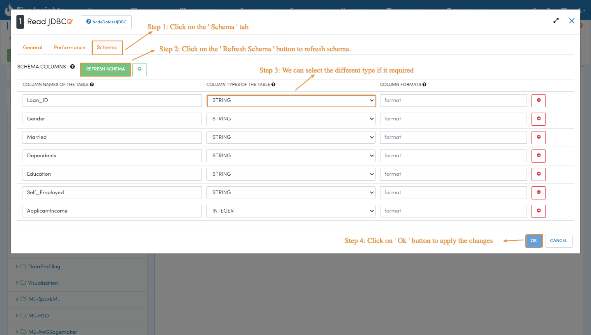
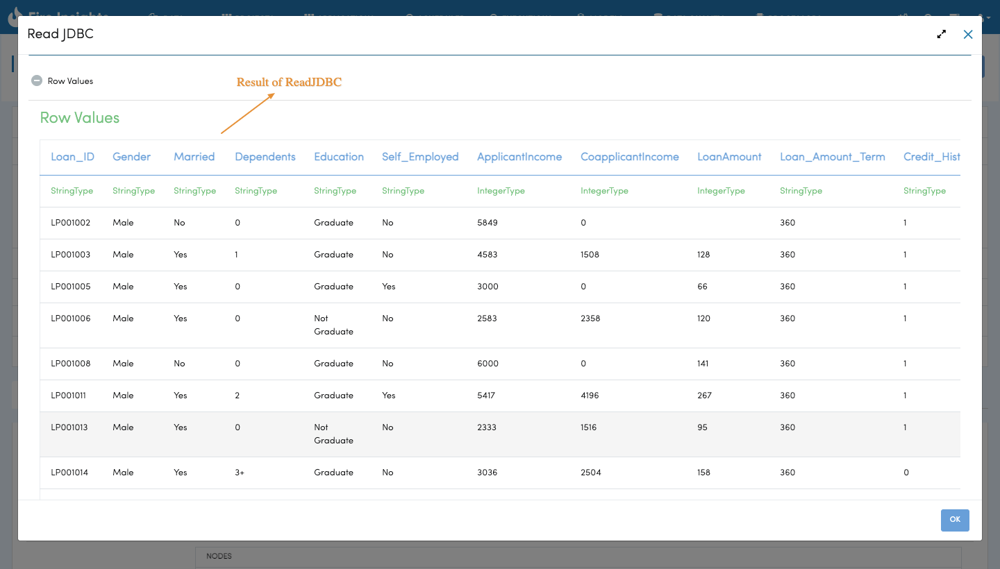

Reading from RDBMS in Workflow
=======================

Fire has JDBC Processors for reading from JDBC sources or writing to JDBC sinks.

In order to connect to a JDBC source like MySQL/Oracle/DB2 etc. the JDBC driver needs to be installed in Fire Insights.

Use the steps here for installing the corresponding JDBC driver for your RDBMS:

- http://docs.sparkflows.io/en/latest/operating/installing-jdbc-drivers.html

Workflow for reading from MySQL
--------------------------------

Below is a workflow which reads data from MySQL and reads the result from ``Print N Rows`` processor. It reads in the data from the ``Loandata`` table in MySQL.

   
   
JDBC Processor Configuration
----------------------------

Below are the configuration details of the JDBC Processor. It uses the provided user for reading from the MySQL database. On clicking on `Refresh Schema`, Fire gets the schema of the table in MySQL and populates the entries.

   
Results of reading from MySQL table
------------------------------------

The below screenshot displays schema of the table from the MySQL table by Fire.

Specifying a Sub-Query
----------------------

In the configuration of the JDBC node, for ``DB TABLE`` anything that is valid in a FROM clause of a SQL query can be used. For example, instead of a full table we could also use a subquery.

 
More details are available on the Spark Guide : https://spark.apache.org/docs/1.6.0/sql-programming-guide.html#jdbc-to-other-databases

Exucute the processor shows the records read from MySQL table.

   

JDBC Drivers
-------------

Below are the JDBC URL's for some databases:

* MySQL : com.mysql.jdbc.Driver
* PostgreSQL : org.postgresql.Driver
* Oracle : oracle.jdbc.driver.OracleDriver

Example JDBC URL
----------------

Below are some examples of JDBC URL for reading from Relational sources:

* MySQL : jdbc:mysql://localhost:3306/mydb
* PostgreSQL : jdbc:postgresql://localhost:5432/mydb

