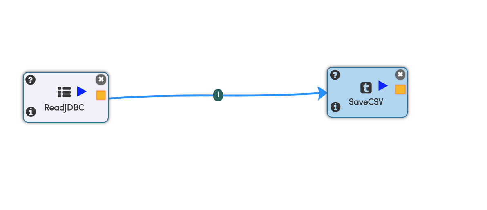
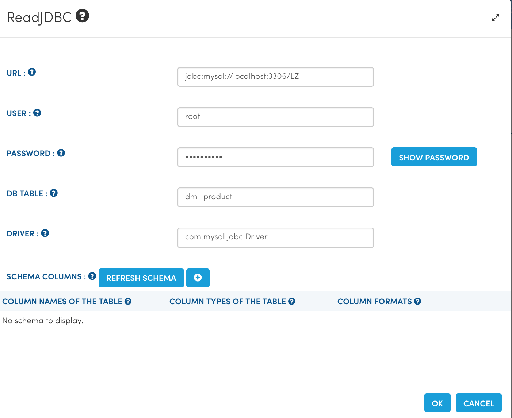
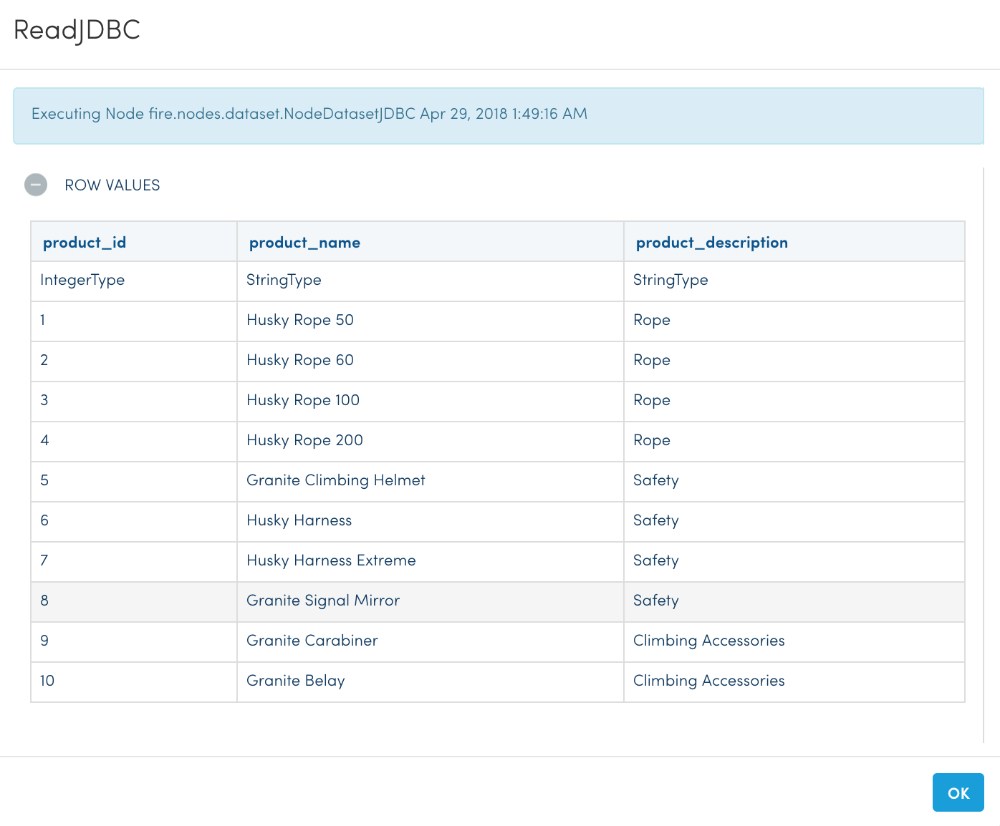
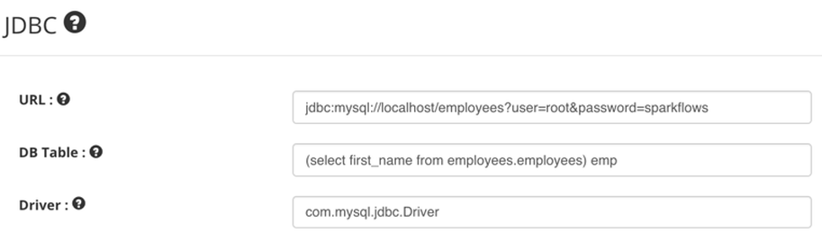
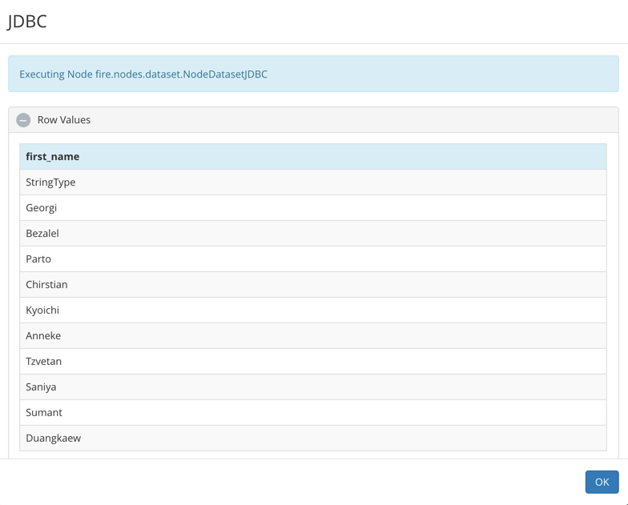

Reading from RDBMS
=======================

Fire has JDBC Processors for reading from JDBC sources or writing to JDBC sinks.

In order to connect to a JDBC source like MySQL/Oracle/DB2 etc. the JDBC driver needs to be installed in Fire Insights.

Use the steps here for installing the corresponding JDBC driver for your RDBMS:

- https://sparkflows.readthedocs.io/en/latest/operating/installing-jdbc-drivers.html

Workflow for reading from MySQL
--------------------------------

Below is a workflow which reads data from MySQL and saves to a CSV file. It reads in the data from the ``dm_product`` table in MySQL and saves it to a CSV file.

   
JDBC Processor Configuration
----------------------------

Below are the configuration details of the JDBC Processor. It uses the provided user for reading from the MySQL database. On clicking on `Refresh Schema`, Fire gets the schema of the table in MySQL and populates the entries.

   
Results of reading from MySQL table
-----------------------------------

The below screenshot displays some of the records read from the MySQL table by Fire.

Specifying a sub-query
--------------------------- 

In the configuration of the JDBC node, for ``db_table`` anything that is valid in a FROM clause of a SQL query can be used. For example, instead of a full table we could also use a subquery in parentheses.

 
More details are available on the Spark Guide : https://spark.apache.org/docs/1.6.0/sql-programming-guide.html#jdbc-to-other-databases

   
   
Above we have specified a subquery which selects only the ‘first_name’ from the employees table.

   

