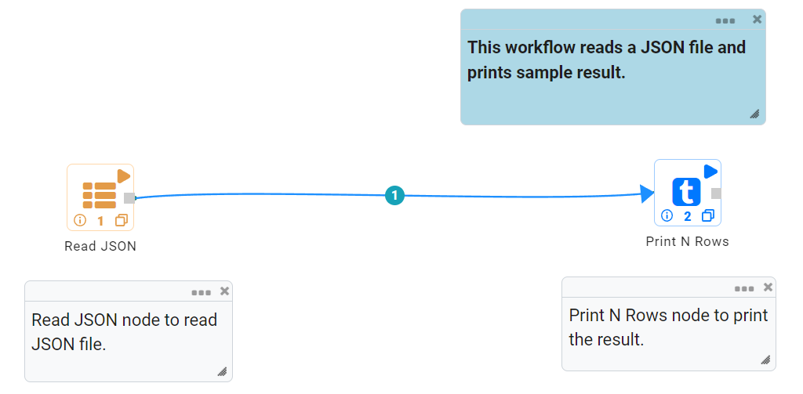
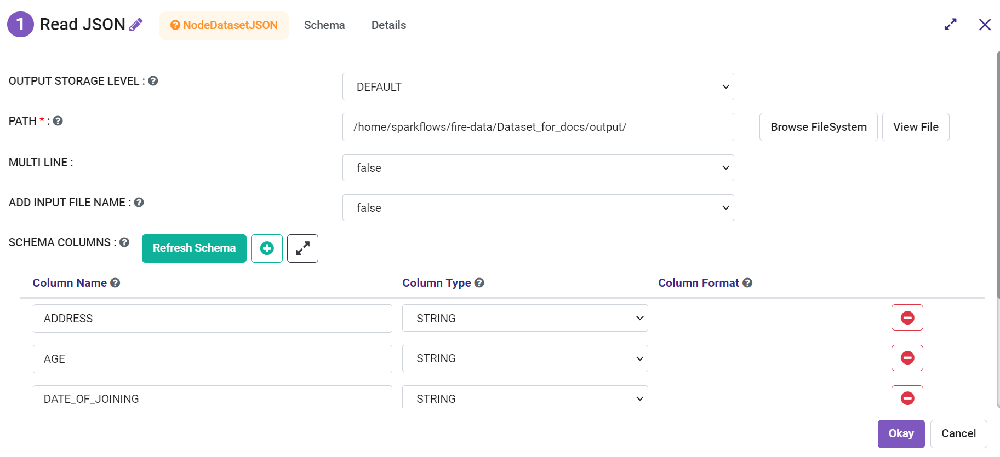
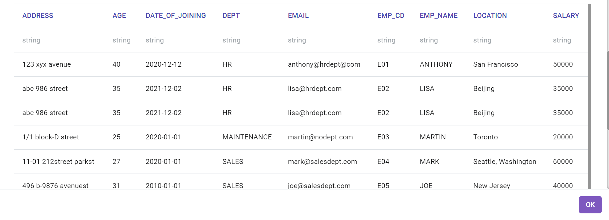

Read JSON Files
==============

Fire Insights enables users to Read JSON files.

Workflow
--------

Below is the workflow. It does the following:

* Reads data from a JSON file.
* Prints the sample result.

Reading from JSON File
---------------------

It reads data from a JSON file using the Read JSON processor.

Processor Configuration
^^^^^^^^^^^^^^^^^^

   
Processor Output
^^^^^^

Prints the Results
------------------

It prints the first few records.
