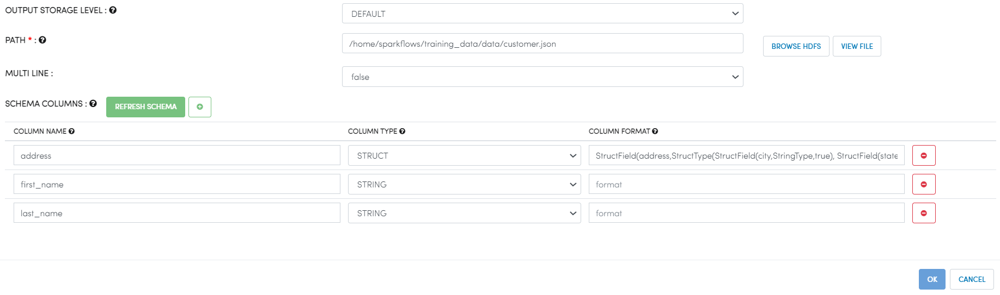
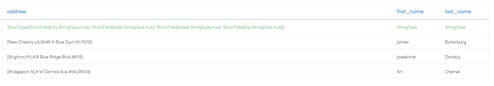
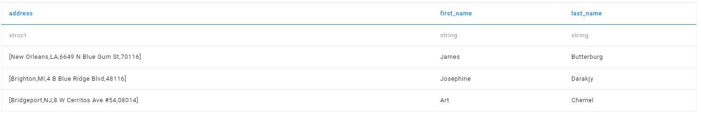

Read JSON Files
==============

Fire Insights enable users to Read json files.

Workflow
--------

Below is the workflow. It does the following:

* Reads data from a json file.
* Print the sample result.

Reading from JSON File
---------------------

It reads data from a json file using the Read JSON processor.

Processor Configuration
^^^^^^^^^^^^^^^^^^

   
Processor Output
^^^^^^

Prints the Results
------------------

It prints the first few records
