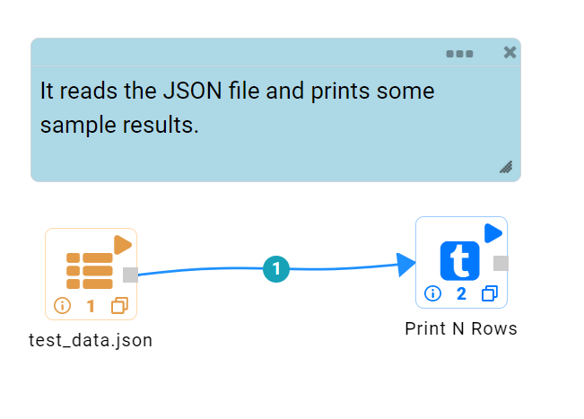

Read JSON Files
==============

Fire Insights enables users to Read JSON files.

Workflow
--------

Below is the workflow. It does the following:

* Reads data from a JSON file.
* Prints the sample result.

Reading from JSON File
---------------------

It reads data from a JSON file using the Read JSON processor.

Processor Configuration
^^^^^^^^^^^^^^^^^^

.. figure:: ../../_assets/user-guide/read-write/17.PNG
   :alt: readwrite
   :width: 55%
   
Processor Output
^^^^^^

.. figure:: ../../_assets/user-guide/read-write/18.PNG
   :alt: readwrite
   :width: 55%

Prints the Results
------------------

It prints the first few records.
