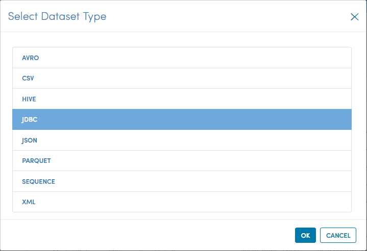
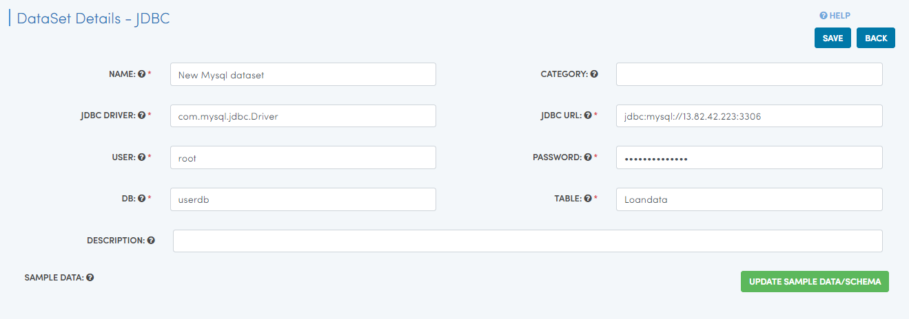
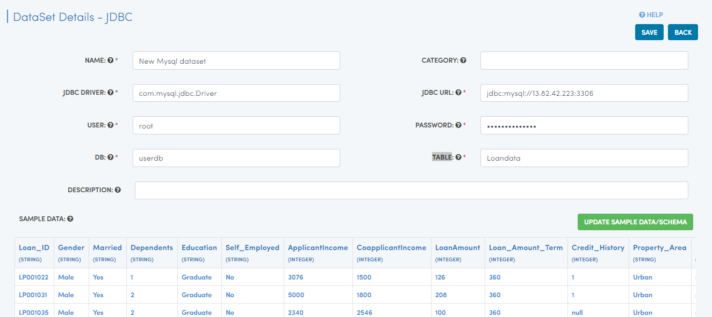
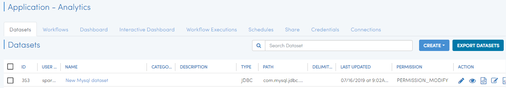

Reading MySQL
============

When working with data in Sparkflows, the first step is to create a dataset that you plan to process subsequently. Dataset is a wrapper around your data which makes it easy to handle it in Sparkflows workbench.

When datasets are created, Sparkflows automatically infers the schema using spark-csv library from Databricks.

Datasets
--------

When you open any application, all existing Datasets specific to the application are displayed in the Datasets tab.

.. figure:: ../../_assets/tutorials/dataset/1.PNG
   :alt: Dataset
   :align: center
   :width: 60%
   
   
Dataset Creation
----------------
 
Navigate to the "Datasets" tab in your application where you want to create a new dataset. Click on the "Create" button and choose "Dataset". In the pop-up choose "JDBC" and then click "OK".

   
 We specified a name for the dataset we are creating. and other parametrs required for it such as JDBC DRIVER, JDBC URL, USER, PASSWORD, DB, & TABLE which is mandatory to fill.
 
Once we have specified the above, we hit the ‘Update Sample data/schema’ button. This brings up the sample data, infers the schema and displays it. We can change the column names and also the data types. Format column is used for specifying the format for date/time fields.

   
Click the ‘Save’ button creates the new dataset that can be used in any workflows or Interactive dashboard within the specific application.

   
   
