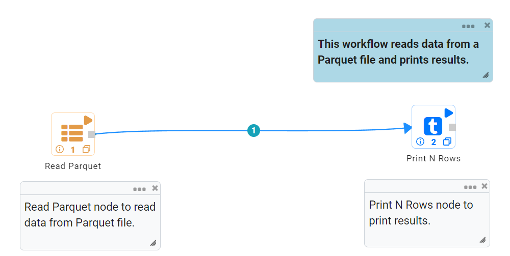
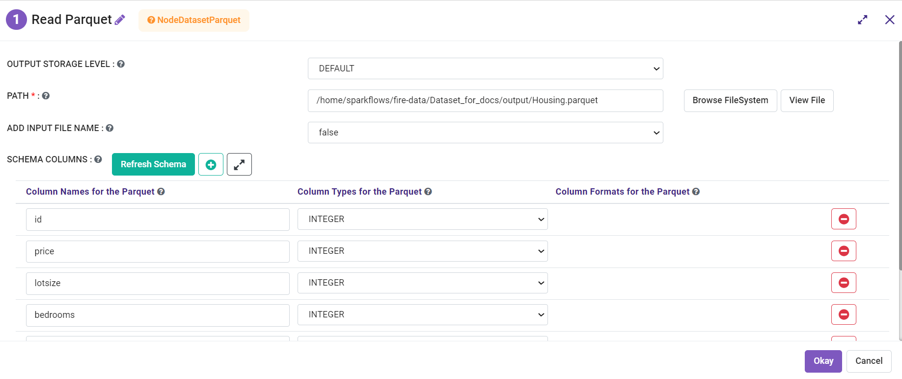
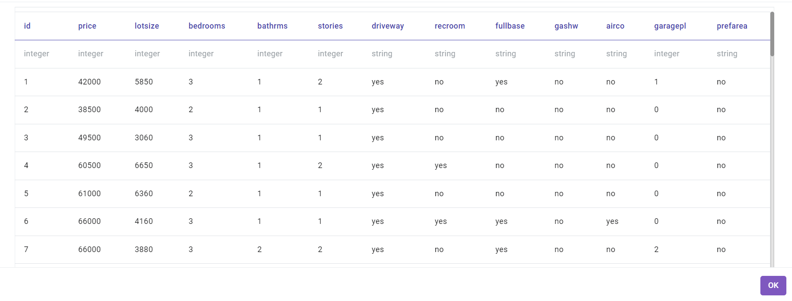

Read Parquet Files
================

Fire Insights enables users to read Parquet files.

Workflow
--------

Below is the workflow. It does the following:

* Reads data from a Parquet file.
* Prints the sample result.

Reading from Parquet File
---------------------

It reads data from a Parquet file using the Read Parquet processor.

Processor Configuration
^^^^^^^^^^^^^^^^^^

   
Processor Output
^^^^^^

Prints the Results
------------------

It prints the first few records.
