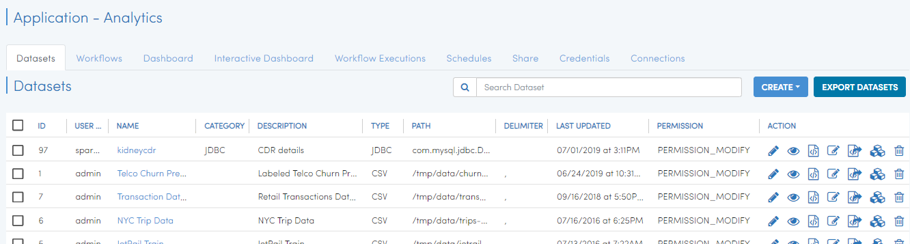
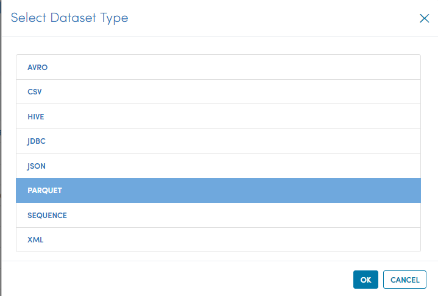
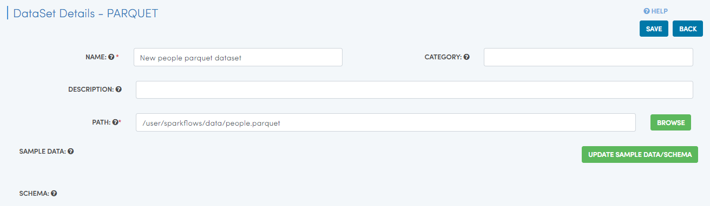
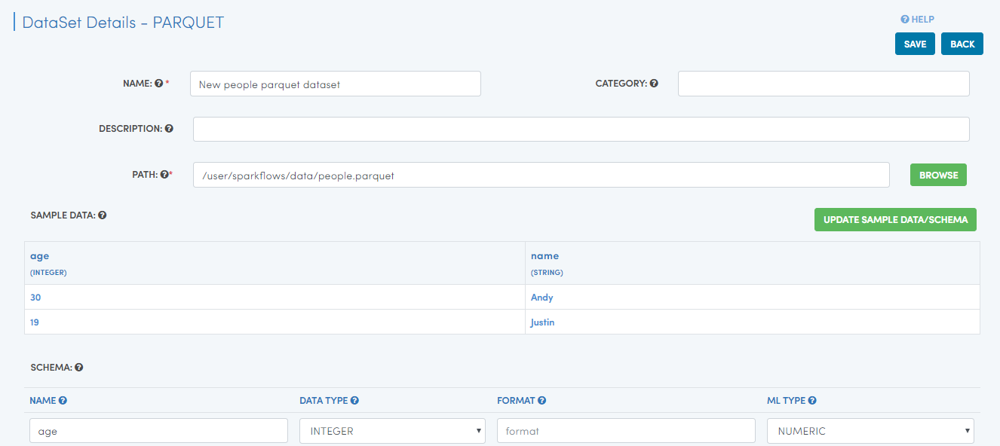
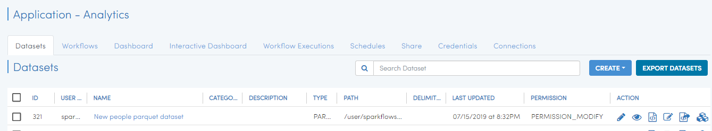

Reading Parquet Files
=====================

Fire insights supports reading from several file formats including Parquet files. Parquet files have schema embedded in them. Fire Insights is able to extract schema of Parquet files automatically.

Datasets
--------

The existing dataSets are displayed in the DataSets page of specific application.

   
Dataset Creation
----------------

Navigate to the "Datasets" tab in your application where you want to create a new dataset. Click on the "Create" button and choose "Dataset". We now create a dataset for people.parquet. It is a parquet file.

In the ‘Create DataSet’ page we fill in the required fields as below.

Above we have specified a name for the dataset we are creating, for Parquet files.

Once we have specified the above, we hit the ‘Update Sample data schema’ button. This brings up the sample data, extracts the schema and displays it. Below we see that there are 2 fields : age and name. Age is of type integer and name is of type string.

   
Clicking the ‘Save’ button creates the new DataSet for us.

Now we are ready to start using our new dataset in Workflows.
