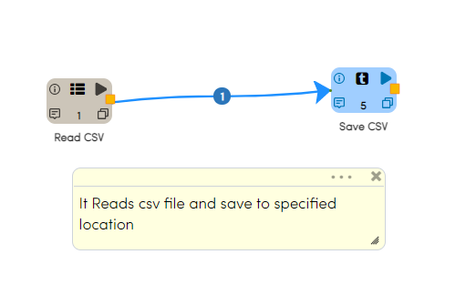
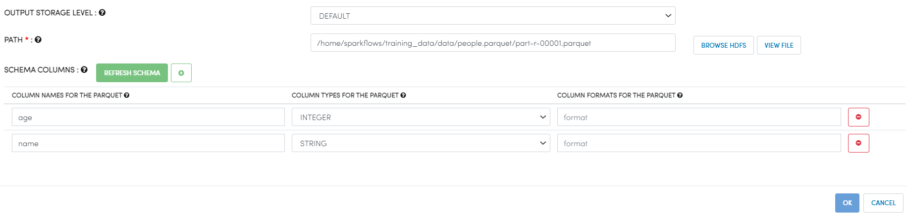
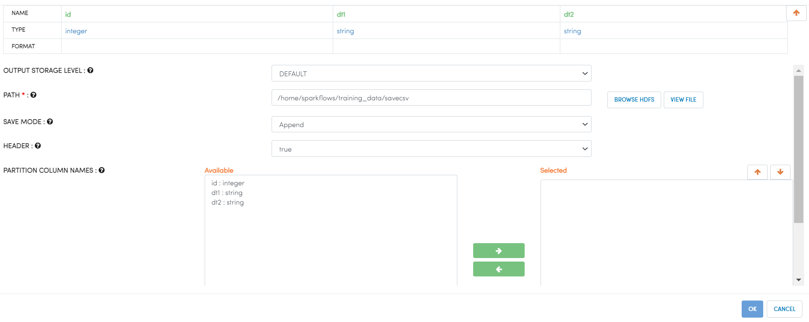

Writing to CSV File
==========

Fire Insights enables user to write CSV files

Workflow
--------

The below workflow does the following:

* Reads data from a CSV file.
* Save CSV to specified location.

Reading from CSV File
---------------------

It reads data from a CSV File using Read CSV Processor.

Processor Configuration
^^^^^^^^^^^^^^^^^^

   
Processor Output
^^^^^^

Save CSV File
----------------

It saves CSV Files in specified location. Use the below field for CSV File

* PATH : Select specified path of CSV File to be saved
* SEPERATOR : CSV separator
* HEADER : True or false depending on file type

Processor Configuration
^^^^^^^^^^^^^^^^^^

   
Once the workflow is executed successfully, the CSV File will be saved to specified location

.. figure:: ../../_assets/user-guide/read-write/6.png
   :alt: readwrite
   :width: 80%
