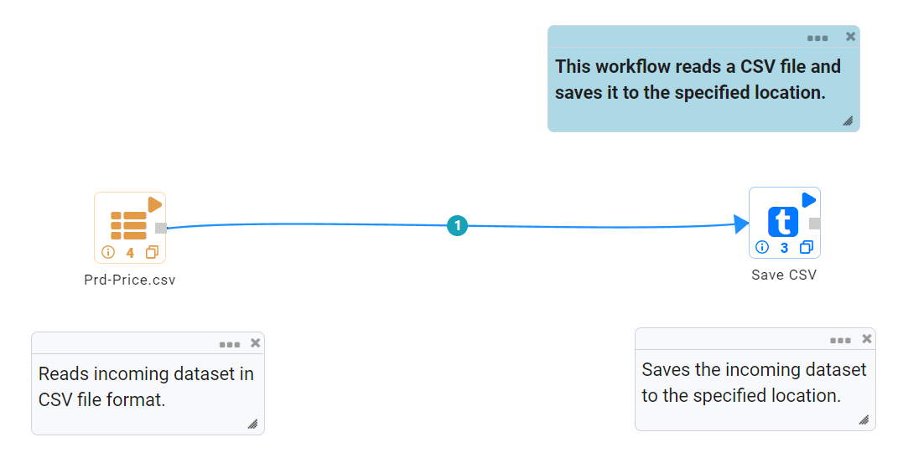
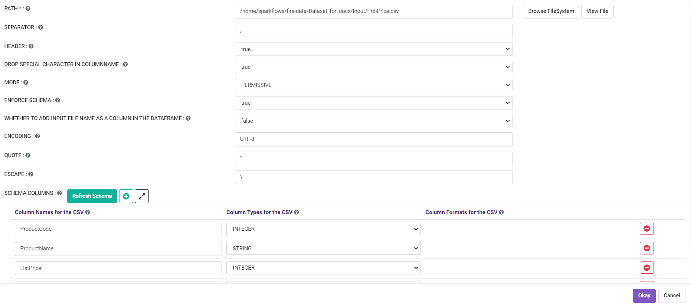
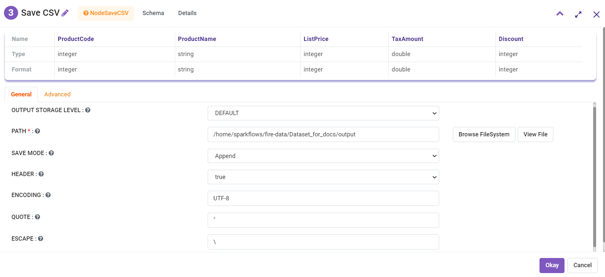

Save as CSV Files
==========

Fire Insights enables the user to write CSV files.

Workflow
--------

The below workflow does the following:

* Reads data from a CSV file.
* Save CSV to a specified location.

Reading from CSV File
---------------------

It reads data from a CSV File using Read CSV Processor.

Processor Configuration
^^^^^^^^^^^^^^^^^^

   
Processor Output
^^^^^^

.. figure:: ../../_assets/user-guide/read-write/save-csv/read-csv-output.png
   :alt: readwrite
   :width: 70%

Save CSV File
----------------

It saves CSV files in a specified location. Use the below field for CSV file.

* PATH : Select a specific path for CSV file to be saved.
* SEPERATOR : CSV separator.
* HEADER : True or false depending on file type.

Processor Configuration
^^^^^^^^^^^^^^^^^^

   
Once the workflow is executed successfully, the CSV file will be saved to specified location.

.. figure:: ../../_assets/user-guide/read-write/save-csv/save-csv-execution.png
   :alt: readwrite
   :width: 70%
