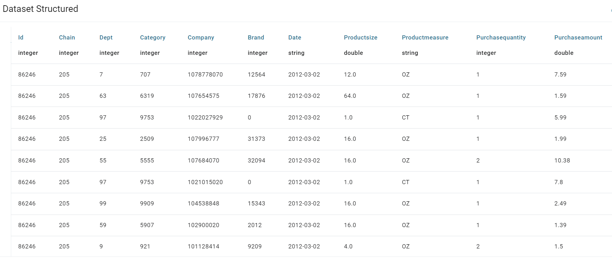
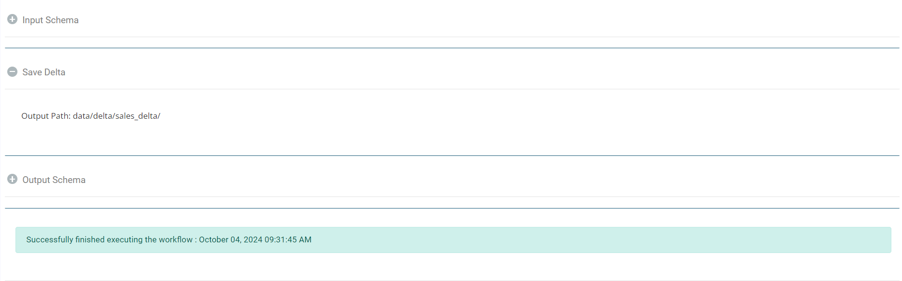

Save to Delta Lake
================

Fire Insights enables the user to write to Delta Lake.

Workflow
--------

Below is the workflow. It does the following:

* Reads Transaction dataset.
* Saves the file to Delta Lake

.. figure:: ../../_assets/user-guide/read-write/Save-Delta/save-delta-workflow.png
   :alt: save-delta-lake
   :width: 60%

Reads transaction dataset
---------------------

It reads the transaction dataset.

Processor configuration
^^^^^^^^^^^^^^^^^^

.. figure:: ../../_assets/user-guide/read-write/Save-Delta/read-dataset-node.png
   :alt: read-dataset-node
   :width: 60%
   
Processor output
^^^^^^

Save to Delta Lake
----------------

It saves the file into the specified Delta Lake location.

Processor configuration
^^^^^^^^^^^^^^^^^^

.. figure:: ../../_assets/user-guide/read-write/Save-Delta/save-delta-general.png
   :alt: save-delta-general
   :width: 60%

.. figure:: ../../_assets/user-guide/read-write/Save-Delta/save-delta-advanced.png
   :alt: save-delta-advanced
   :width: 60%

|
Once the workflow is executed successfully the file will be saved to the specified Delta Lake location.

