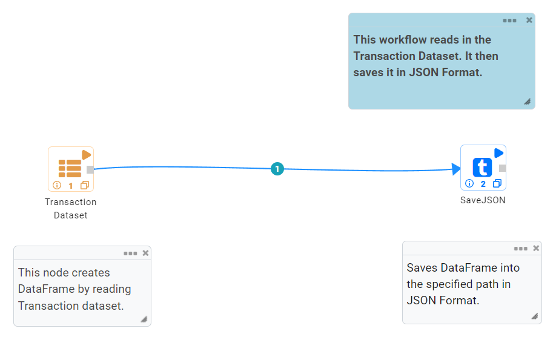
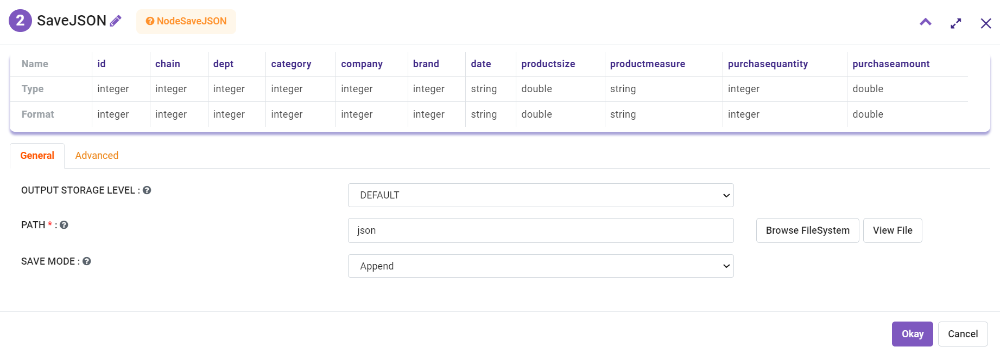
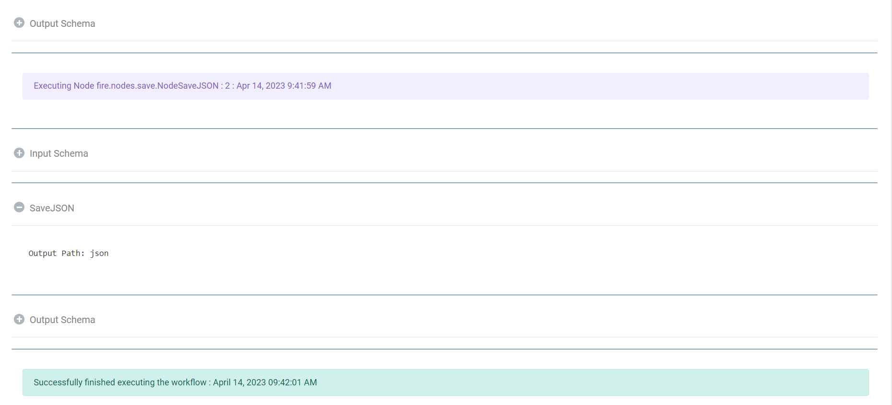

Save as JSON Files
=====================

Fire Insights enables you to write your DataFrame to JSON files.

Workflow for writing as JSON files
----------------------

   

Reading from dataset
----------------------

Node ``TransactionDataset`` creates DataFrame of your dataset named 'Transaction Dataset' by reading data from HDFS, HIVE etc. which have been defined earlier in Fire by using the Dataset feature. As a user you just have to select the Dataset of your interest and configure the details as shown below.

.. figure:: ../../_assets/user-guide/read-write/Save-Parquet/read-config.png
   :alt: NodeDatasetStructured
   :width: 70%

Processor output
----------------

.. figure:: ../../_assets/user-guide/read-write/Save-Parquet/read-output.png
   :alt: NodeDatasetStructured
   :width: 70%

SaveJSON Processor Configuration
--------------------

Node ``SaveJSON`` saves DataFrame into the specified path in JSON Format. When running on Hadoop, JSON files gets saved into HDFS.

   

Once the workflow is executed successfully the json file will be saved to specified location.

