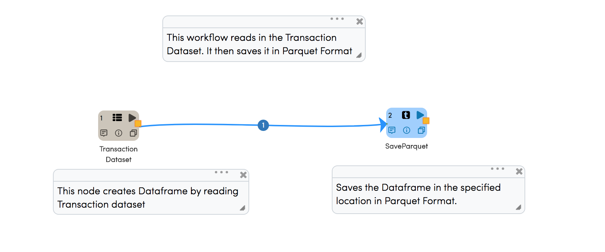
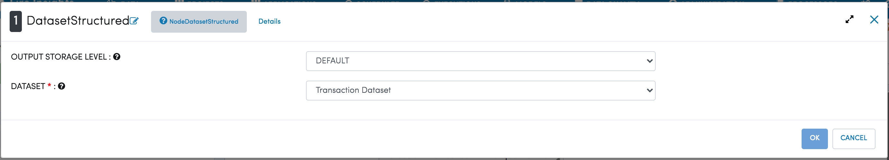
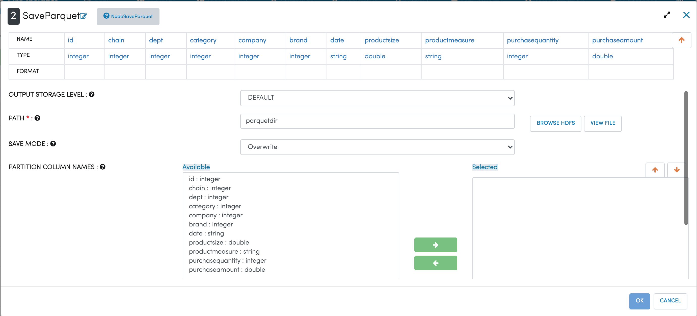

Writing to Parquet Files
========================

Fire Insights enables you to write your Dataframe to Parquet Files.

Workflow for writing to Parquet file
----------------

Below is a workflow example which reads in transaction data. It then writes it out to Parquet files.

   
   
DatasetStructured Processor
--------------------------
   
Node ``DatasetStructured`` creates a Dataframe of your dataset named ``Transaction Dataset`` by reading data from HDFS, HIVE etc. which had been defined earlier in Fire by using the Dataset feature.

As a user you have to select the Dataset of your interest as shown below.

SaveParquet Processor
---------------------

``SaveParquet`` processor saves the incoming DataFrame into the specified path in Parquet Format. When running on Hadoop, Parquet files gets saved into HDFS.

The DataFrame might be written as multiple part files in the specified folder, depending on the size and partition of the DataFrame.

