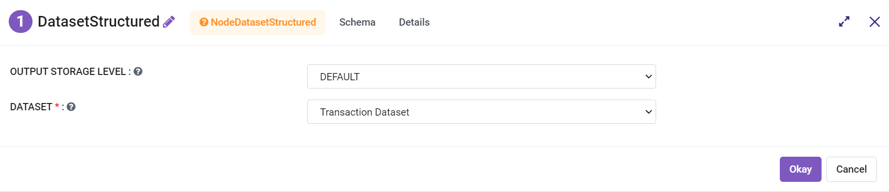
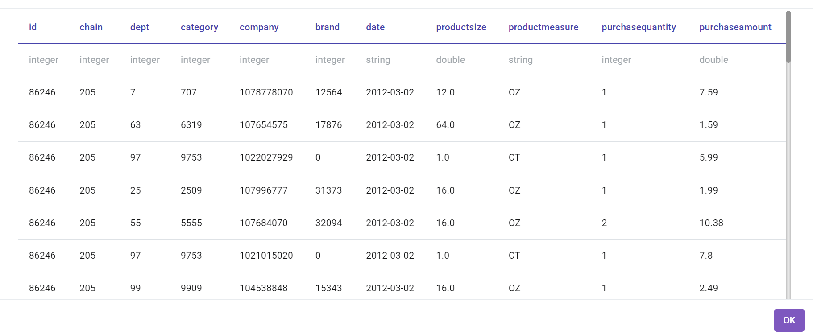
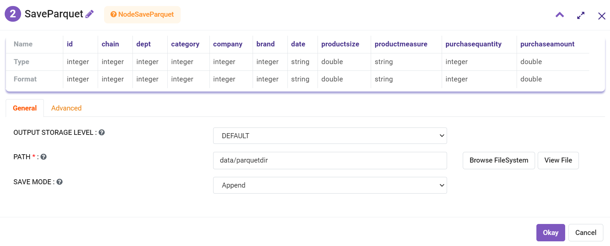
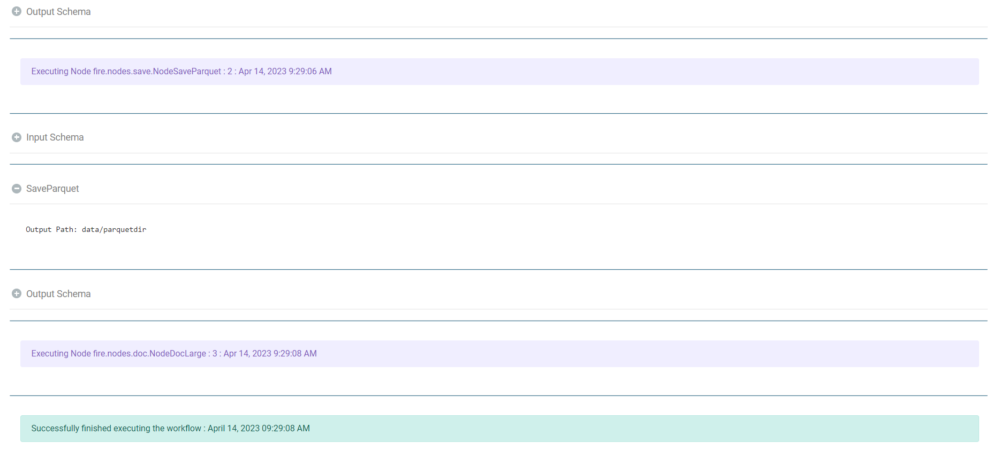

Save as Parquet Files
================

Fire Insights enables the user to write in a Parquet file.

Workflow
--------

Below is the workflow. It does the following:

* Reads transaction dataset.
* Saves Parquet file to the specified location.

.. figure:: ../../_assets/user-guide/read-write/Save-Parquet/save-parquet-wf.png
   :alt: readwrite
   :width: 70%

Reads transaction dataset
---------------------

It reads the transaction dataset.

Processor configuration
^^^^^^^^^^^^^^^^^^

   
Processor output
^^^^^^

Save Parquet file
----------------

It saves the Parquet file in the specified location.

Processor configuration
^^^^^^^^^^^^^^^^^^

   
Once the workflow is executed successfully the Parquet file will be saved to the specified location.

