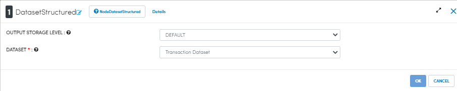

Writing to Parquet Files
========================

Fire Insights enables you to write your Dataframe to Parquet Files.

Workflow for writing to Parquet file
----------------

Below is a workflow example which reads in transaction data. It then writes it out to Parquet files.

.. figure:: ../../_assets/tutorials/read-write/writing-parquet/Parquet%20workflow.PNG
   :alt: Parquet Worflow
   :align: center
   :width: 60%

NodeTansactionDataset creates Dataframe Of your dataset named TransactionDataset by reading data from HDFS, HIVE etc. which had been defined earlier in Fire by using the Dataset feature. As a user you just have to select the Dataset of your interest and configure the details as shown below

