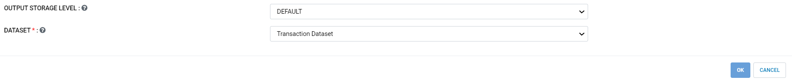
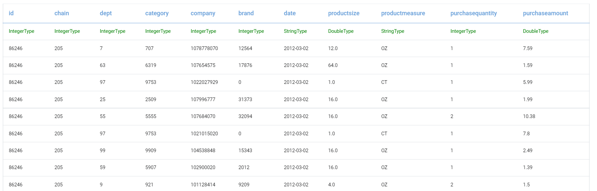
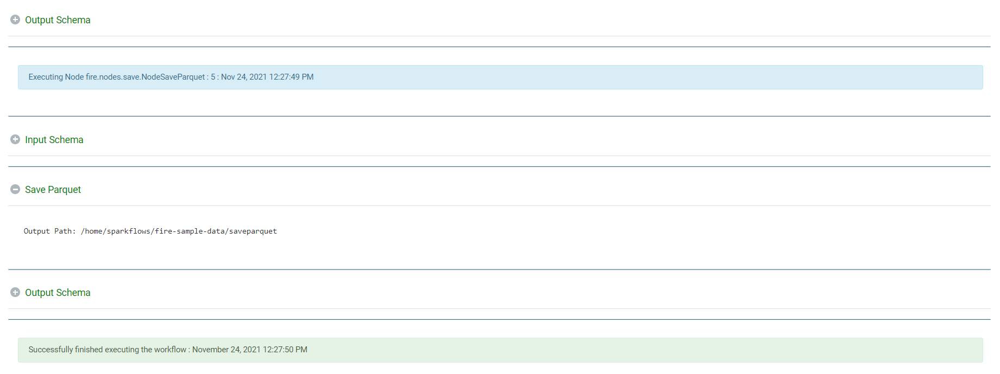

Save as Parquet Files
================

Fire Insights enables the user to write in a Parquet file.

Workflow
--------

Below is the workflow. It does the following:

* Reads transaction dataset.
* save parquet to the specified location.

.. figure:: ../../_assets/user-guide/read-write/SaveParquet.png
   :alt: readwrite
   :width: 80%

Reads transaction dataset
---------------------

It reads the transaction dataset.

Processor Configuration
^^^^^^^^^^^^^^^^^^

   
Processor Output
^^^^^^

Save parquet file
----------------

It saves the parquet file in the specified location.

Processor Configuration
^^^^^^^^^^^^^^^^^^

.. figure:: ../../_assets/user-guide/read-write/34.PNG
   :alt: readwrite
   :width: 80%
   
Once the workflow is executed successfully the parquet file will be saved to a specified location.

