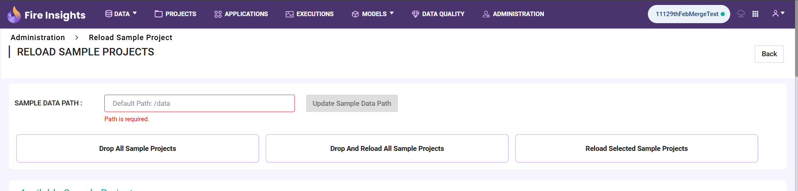

Loading Sample Projects
=============================

This tutorial explains the process of loading sample projects.

This feature of load sample projects allows the user to load the data from any path configured by admin. It also provides the user to create projects that are private and accessible only to them."

The steps for the same are as follows:

Step 1 :  Configure the Path
----------------------------------
#. **Login** to Fire Insights.

   .. figure:: ../../_assets/tutorials/load-sample-project/Login.png
      :alt: Load Sample Projects
      :width: 65% 

#. Navigate to **Administration->Configurations**, as shown below.
   
   .. figure:: ../../_assets/tutorials/load-sample-project/adminPage.png
      :alt: Load Sample Projects
      :width: 65% 

#. Search the variable **app.sampleDataPath** and enter the path of the folder where the data for sample projects has been stored. Then Click on **Save Configurations** button.

   .. figure:: ../../_assets/tutorials/load-sample-project/ConfigurationsPage.png
      :alt: Load Sample Projects
      :width: 65% 

   The saved configurations are displayed below showing the notification "Configurations Saved Successfully":

   .. figure:: ../../_assets/tutorials/load-sample-project/Savedconfigurations.png
      :alt: Load Sample Projects
      :width: 65% 

Step 2 : Reloading Sample Project
---------------
#. Navigate to **Projects** tab and click on **Reload Sample Project**.

   .. figure:: ../../_assets/tutorials/load-sample-project/AllProjectlistPage.png
      :alt: Load Sample Projects
      :width: 65% 

#. It will then display a pop-up showing the path configured by the admin, as shown below. Then click on **Submit** button.

   .. figure:: ../../_assets/tutorials/load-sample-project/reloadPopUp.png
      :alt: Load Sample Projects
      :width: 65% 

Step 3: Loading Sample Projects
-----------
#. Under the **Projecs** tab in Sample Projects list showing all the reloaded sample projects, click on the **Load Sample Project** button to load a single project.

   .. figure:: ../../_assets/tutorials/load-sample-project/sampleProjectListPage.png
      :alt: Load Sample Projects
      :width: 65% 

#. If the user tries to load the project which is already present, it will show an **error message** below the **PROJECT NAME** text box, as shown below.

   .. figure:: ../../_assets/tutorials/load-sample-project/UniqueProjectName.png
      :alt: Load Sample Projects
      :width: 65% 

#. To proceed further, the user can give a new project name after clicking on the sample project that already exists.

   .. figure:: ../../_assets/tutorials/load-sample-project/NewProjectName.png
      :alt: Load Sample Projects
      :width: 65% 

   Now, it will display the loaded project in **All** tab of the Projects List page, as shown below.

   .. figure:: ../../_assets/tutorials/load-sample-project/NewProjectNameInProject.png
      :alt: Load Sample Projects
      :width: 65% 

UPDATE SAMPLE DATA PATH AND RELOAD SAMPLE PROJECTS
-------------------
#. Navigate to **ADMINISTRATION** and click on **Sample Projects**.

   .. figure:: ../../_assets/tutorials/load-sample-project/adminPage.png
      :alt: Load Sample Projects
      :width: 65% 

#. The text box beside the update sample data path button will reflect the path which is being set in the configuration by the admin.

   .. figure:: ../../_assets/tutorials/load-sample-project/adminSampleProjectsPage.png
      :alt: Load Sample Projects
      :width: 65% 

#. To update the sample data path, enter the desired path and then click the **Update Sample Data Path** button. The updated data path will also be saved in the Configurations.

   .. figure:: ../../_assets/tutorials/load-sample-project/updateSampleDataPath.png
      :alt: Load Sample Projects
      :width: 65% 

#. If you click on Drop All Sample Projects, all the sample projects will be deleted.

   .. figure:: ../../_assets/tutorials/load-sample-project/DropAllProjects.png
      :alt: Load Sample Projects
      :width: 65% 

   The Sample Projects tab on the Projects List page will no longer be visible

   .. figure:: ../../_assets/tutorials/load-sample-project/NoSampelProjectTab.png
      :alt: Load Sample Projects
      :width: 65% 

#. If you click on Drop And Reload All Sample Projects, all the current sample projects will be deleted, and all sample projects will be reloaded.

   .. figure:: ../../_assets/tutorials/load-sample-project/DropAndReload.png
      :alt: Load Sample Projects
      :width: 65% 

#. To reload specific sample projects, select the desired sample projects and click on **Reload Selected Sample Projects**.

   .. figure:: ../../_assets/tutorials/load-sample-project/SelectedReloadProjects.png
      :alt: Load Sample Projects
      :width: 65% 

   .. figure:: ../../_assets/tutorials/load-sample-project/ReloadedSelectedSampleProejct.png
      :alt: Load Sample Projects
      :width: 65% 

WHEN THE SAMPLE DATA PATH IS EMPTY
++++++++++

If the sample data path variable **app.sampleDataPath** is set to empty, it will take the path as **/data**. 

 
.. note:: The sample data path can be set to empty only through configurations.

