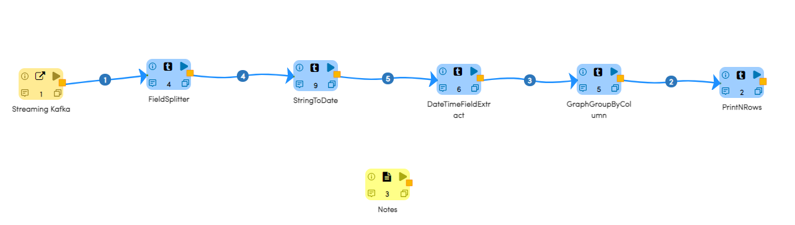
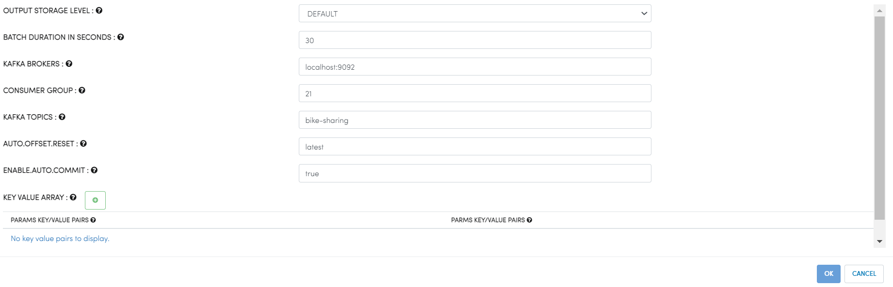
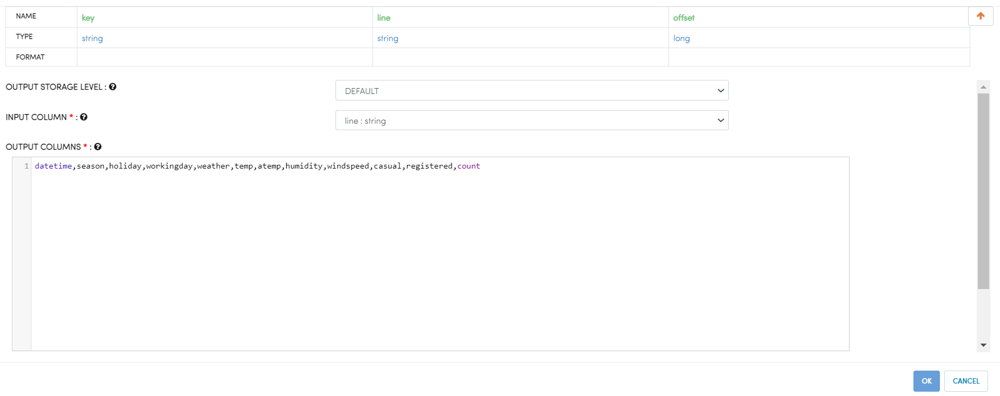
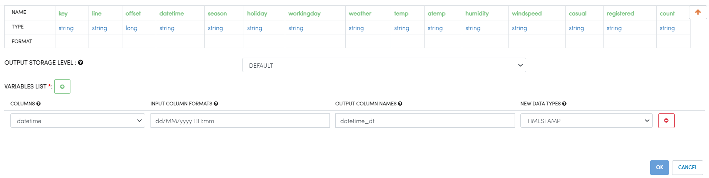
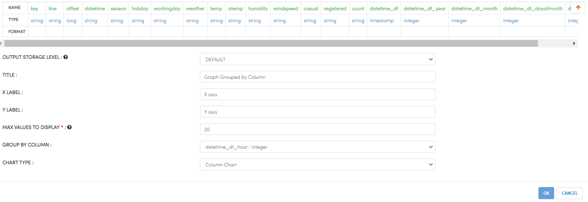
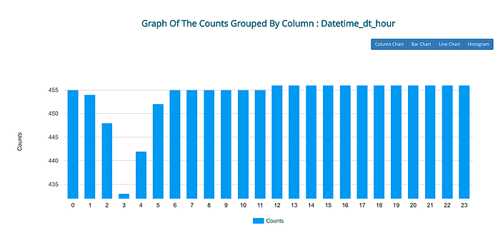
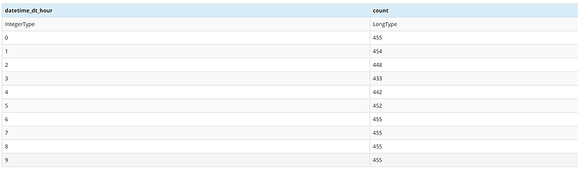
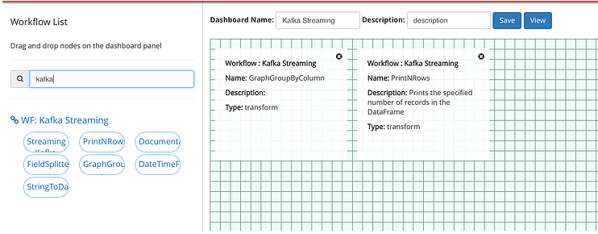
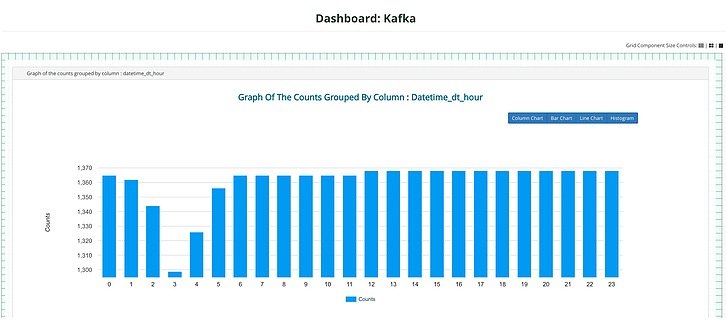

Streaming Analytics Bike Sharing Dataset
========================================

Streaming Analytics with Apache Kafka and Apache Spark Streaming.

At Fire we are obsessed with powering our users to build amazing data analytics applications in less than 30 mins.

Below we build a Streaming Analytics workflow and dashboard. It-

- Reads bike sharing data from Kafka.
- Parses the incoming data.
- Finds the number of rentals on an hourly basis.
- Displays the results visually in a graph. 

DataSet
--------

The dataset contains bike rental info from 2011 and 2012 in the Capital bikeshare system, plus additional relevant information.

This dataset is from Fanaee-T and Gama (2013) and is hosted by the UCI Machine Learning Repository. It consists of 10877 rows ( can be found in /data directory of the Fire installation). Each record is count of rentals grouped by a given hour in the past and environmental factors at that time (season, holiday, temperature, wind-speed etc.)

Start Kafka and create Topic 'bike-sharing'
-------------------------------------------

- The quick start guide of Kafka is at : https://kafka.apache.org/quickstart
- The steps for Kafka are:  
- Download Kafka. 
- Start zookeeper and Kafka server. You can also use an existing instance of Zookeeper/Kafka.
- bin/zookeeper-server-start.sh config/zookeeper.properties
- bin/kafka-server-start.sh config/server.properties
- Create the topic 'bike-sharing'.
- bin/kafka-topics.sh --create --zookeeper localhost:2181 --replication-factor 1 --partitions 1 --topic bike-sharing

Send the data file 'bike_sharing_noheader.csv' to the Kafka Topic
-----------------------------------------------------------------

- bike_sharing_noheader.csv is in the data directory of the Fire Install
- cat bike_sharing_noheader.csv | bin/kafka-console-producer.sh --broker-list localhost:9092 --topic bike-sharing 

Workflow
--------

Below is a workflow for Streaming Analytics of the Bike Sharing dataset.

   
It consists of 6 Nodes: 

- StreamingKafka - It reads in streaming data from the Kafka topic bike-sharing.
- FieldSplitter - It splits each line in fields. 
- StringToDate - It converts the datetime column into Timestamp type. 
- DateTimeFieldExtract : It extracts year, month, day, hour from the datetime column.
- GraphGroupByColumn - It groups the data on the hour column, sums it up and display it in a Graph.  
- PrintNRows : It prints the first 10 records in a table.

Streaming Kafka
----------------

It reads in streaming data from Kafka and creates a DataFrame with one column containing the lines.

   
FieldSplitter
-------------

It splits each line on the separator - comma - and outputs a new DataFrame with the columns defined.

   
StringToDate
------------

It converts the datetime column into new column of type 'Timestamp'.

DateTimeFieldExtract
---------------------

It extracts the year, month, day of month and hour from the datetime_dt column.

.. figure:: ../../_assets/tutorials/dataset/StreamingWorkflow-5.PNG
   :alt: Dataset
   :width: 70%
   
   
GraphGroupByColumn
------------------

It aggregates the data on the hour column, and displays it in a Graph.

Executing the workflow
----------------------

When the workflow is executed, Fire submits a spark streaming job to the Spark cluster. The spark streaming job keeps running and processing the incoming from Kafka. Below are some of the output produced by the job.

   
Streaming Dashboard
-------------------

Since, we are still very much under 30 minutes, we also go ahead and create a Dashboard for the workflow. Since, we have set the mini-batch duration to be 30 seconds, the Dashboard would update itself every 30 seconds.

Below is the Dashboard editor. Select the nodes whose output you want to be displayed and drag and drop them onto the canvas.

   

   
   

   
   
   
