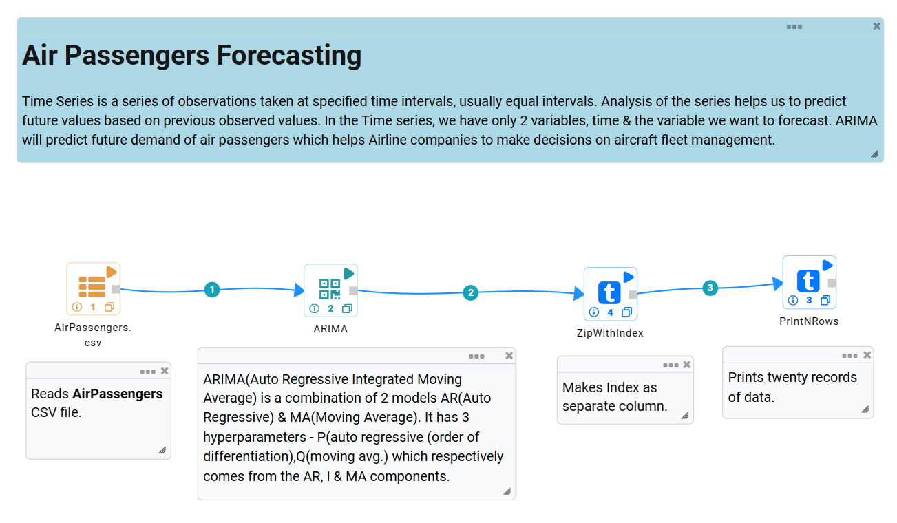
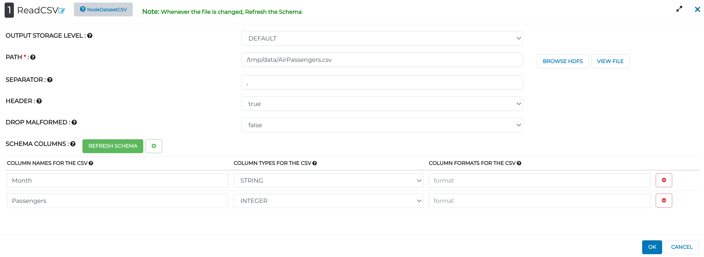
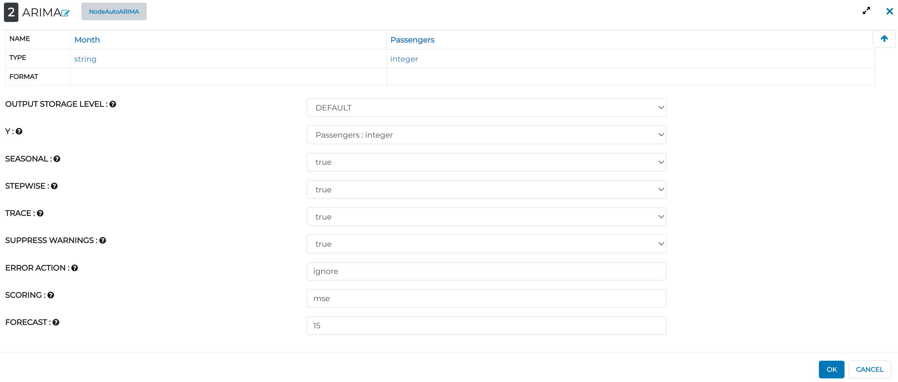
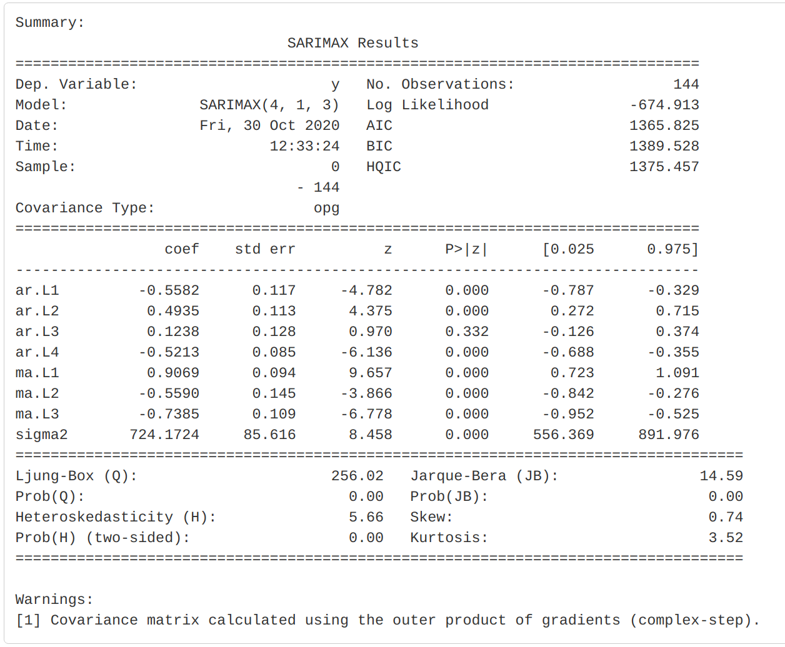
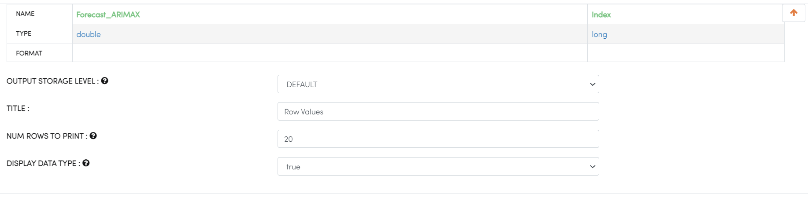
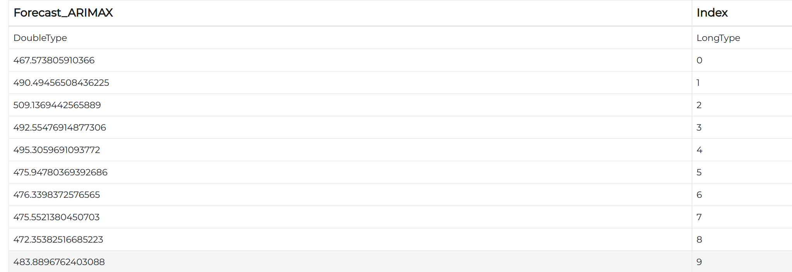

Air Passengers Forecasting
==========================

Objective
---------

The objective is to develop a time series model to predict future demand of air passengers which helps Airline company to take decision on aircraft fleet management.

Dataset
--------

Dataset contains 2 columns as follows:-

* Month - Month of the year.

* Passengers - Total number of passengers travelled in that particular month.

* Air Passengers Occupancy Prediction.

Time Series Modelling Workflow on Univariate Data
--------------------------------------------------

The auto_arima work to fit the best ARIMA(Autoregressive Integrated Moving Average) model to a univariate time arrangement is indicated by either AIC, AICc, BIC or HQIC. The capacity plays out an inquiry (either stepwise or parallelized) over conceivable model requests inside the requirements given. 

The auto_arima capacity can be overwhelming. There are a ton of boundaries to tune, and the result is vigorously subject to various themes. In this segment, we spread out a few contemplations you'll need to make when you fit your ARIMA models.

Node 1 - ReadCSV
++++++++++++++++

* Reads the given CSV file : AirPassengers.csv

   

Node 2 - ARIMA
++++++++++++++++

* p - The number of lag observations included in the model, also called the lag order.
* d - The number of times that the raw observations are different, also called the degree of differencing.
* q - The size of the moving average window, also called the order of moving average.

Not to worry about p,d,q in this case because we have an interesting model called  - AUTO-ARIMA (Able to select automatically optimal value).

* Y - Target Variable (Passengers Per Month).
* SEASONAL - Automatically True but you can change as false if you want as non-seasonal.
* SCORING - How do you want to evaluate your model performance like - MSE, MAE.
* FORECAST - Number of steps you want to forecast.

   
Summary
++++++++
 
* The model summary reveals a lot of information.
   

Node 3 - ZipWithIndex
+++++++++++++++++++++

* Creates new column from index of Dataset.

Node 4 - PrintNRows
+++++++++++++++++++

* Number of rows you want to print to see the final result.

   
Final Result
------------
 
Lets check a few rows of forecasted data by ARIMA Model.
 

