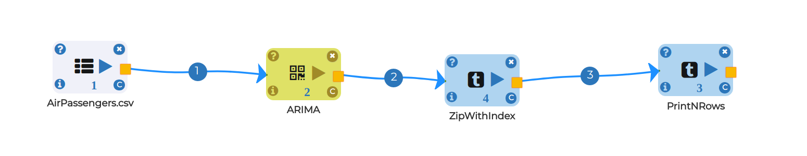

Stock Forecasting
=================
The auto_arima work fits the best ARIMA(Autoregressive Integrated Moving Average) model to a univariate time arrangement as indicated by either AIC, AICc, BIC or HQIC. The capacity plays out an inquiry (either stepwise or parallelized) over conceivable model requests inside the requirements given. 

The auto_arima capacity can be overwhelming. There are a ton of boundaries to tune, and the result is vigorously subject to various themes. In this segment, we spread out a few contemplations you'll need to make when you fit your ARIMA models.

Time Series Modelling Workflow on Univariate Data
-----------------------------------------------------------

Node 1 - Readcsv
----------------

* Read data from using Readcsv node by passing path

* click on browse HDFS and select AirPassengers dataset

* Select data type from COLUMN TYPES FOR THE CSV and click OK

.. figure:: ../../_assets/tutorials/time-series/ARIMA_readcsv.png
   :alt: Stock Forecasting
   :align: center
   :width: 60%

Node 2 - ARIMA
----------------

* p - The number of lag observations included in the model, also called the lag order.
* d - The number of times that the raw observations are different, also called the degree of differencing.
* q - The size of the moving average window, also called the order of moving average.

Don't worry about p,d,q in this case because we have something interesting model called  - AUTO-ARIMA(Able to select automatically optimal value)

* Y - Target Variable(Passengers Per Month)
* SEASONAL - automatically True but you can change as false if you want as non-seasonal
* STEPWISE - If you want to use flexibility of auto-arima so keep it true
* TRACE - Print parameters used in auto-arima
* SUPPRESS WARNINGS - Ignore warnings
* ERROR ACTION - You can also ignore errors it get automatically handled 
* SCORING - How you want to evaluate your model performance like - MSE, MAE
* FORECAST - Number of steps you want to get forecasted

.. figure:: ../../_assets/tutorials/time-series/ARIMA_model.png
   :alt: Stock Forecasting
   :align: center
   :width: 60%
