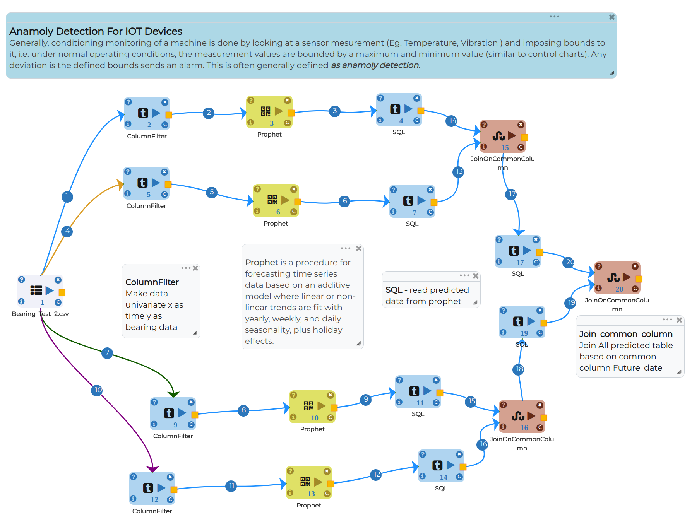
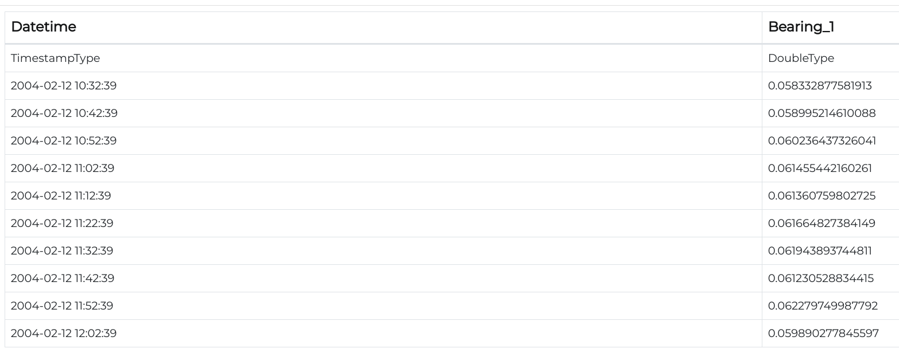
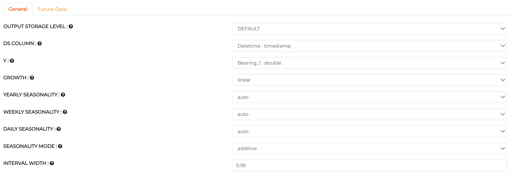
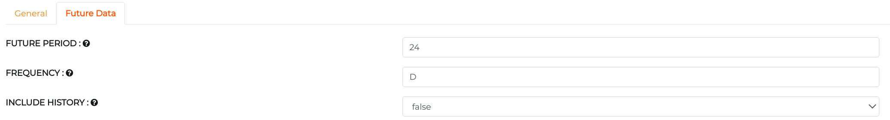
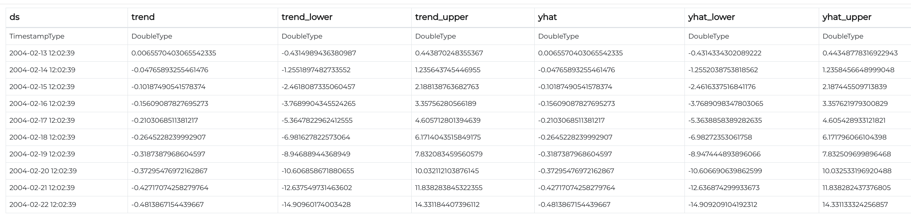
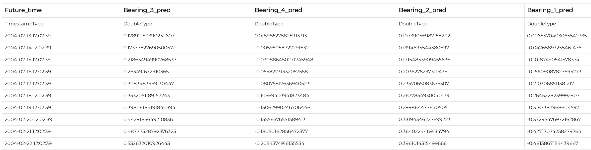

Anomaly Detection for IoT Devices
=================================

Objective
---------
Anomaly detection issue for time arrangement can be planned, as discovering exceptional information guides relates towards some norm or common sign. Our center will be from a machine perspective, for example, surprising spikes, level move highlighting disintegrating soundness of a machine.

Dataset
--------

Dataset contains 4 columns as below:-

* Datetime - 10 mins time interval of accelerometer data.
* 4-Bearings - Contains reading of devices.

Anomaly Detection using Prophet Time Series Model Workflow
-----------------------------------------------------------

Prophet is a procedure for forecasting time series data based on an additive model where non-linear trends fit with yearly, weekly, daily, seasonal and holiday effects. It works best with time series that have strong seasonal effects and several seasons of historical data. Time-series anomaly detection is a feature used to identify unusual patterns that do not conform to expected behavior, called outliers.

   
Data Preprocessing
------------------

* **Column Filter** Converts Multivariate Data into univariate for Prophet Model.

   
* **Output** Univariate Data.

   
Data Modeling
-------------

* **Prophet** Model for anomaly detection using Mean as threshold value.

**General Section of Prophet Model**

* Set Datetime column in DS column field.
* Y is the target variable. Set it to the reading of bearings.
* Set Growth as linear or logistic.
* We are using Prophet Model so that it is self-sufficient to select seasonality in auto mode.
* Set mode of seasonality as additive or multiplicative.
* Set confidence Interval (0 to 1) which gives a range of plausible values for the parameter of interest.

**Future Data section of Prophet Model**

* FUTURE PERIOD block gives the number of steps we want to predict. 
  

   
* **SQL** sets mean column to set threshold.

   
Model prediction
----------------

* **Threshold** to compare anomaly.

