Stock Forecasting
=================

Objective
---------
Stock forecasting helps production units to get an idea about raw material, pricing of goods, improvement in supply, chain management and proper control of sales.

Dataset
--------

Dataset contains 4 columns as follows:-

* Date - Date when product was sold
* Store - Store id from where product got sold
* Item - Item id
* Sales - Quantity of product sold

Predict future sales of items at particular store  

Prophet Time Series Modelling Workflow on Multivariate Data
-----------------------------------------------------------

Prophet is a procedure for forecasting time series data based on an additive model where non-linear trends fit with yearly, weekly, daily, seasonality and  holiday effects. It works best with time series that have strong seasonal effects and several seasons of historical data. Prophet is robust to missing data and shifts in the trend, and typically handles outliers well.

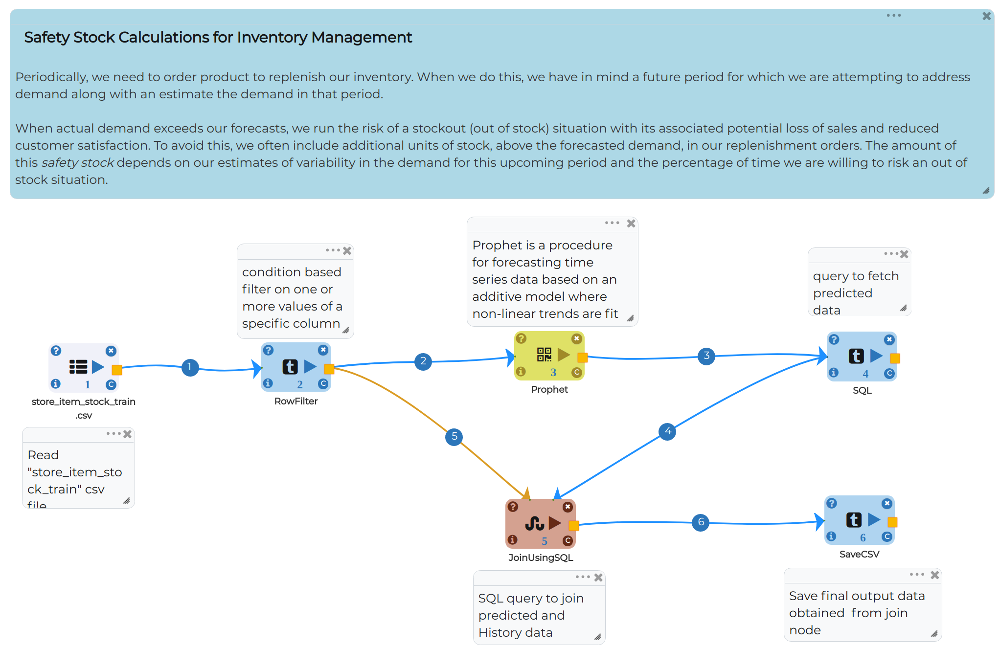

Node 1 - ReadCSV
++++++++++++++++

* Reads the given CSV file : store_item_stock_train.csv

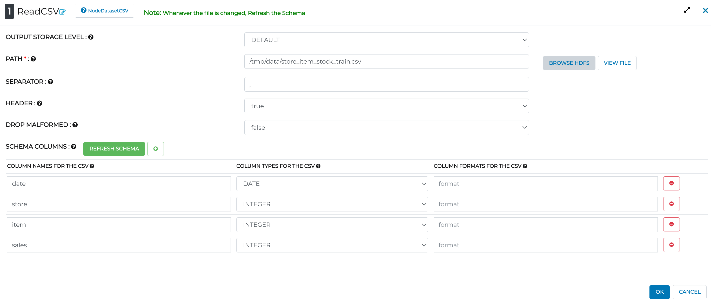

* Below are the first 10 rows of data
* Columns contain data as datetype, store and item which are categorical variables and sales which is a continuous variable.

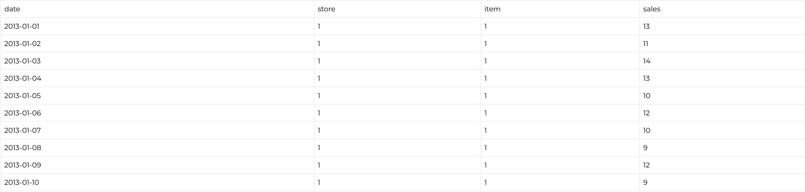

Node 2 - RowFilter
++++++++++++++++++

* Filters data by row with respect to store and item

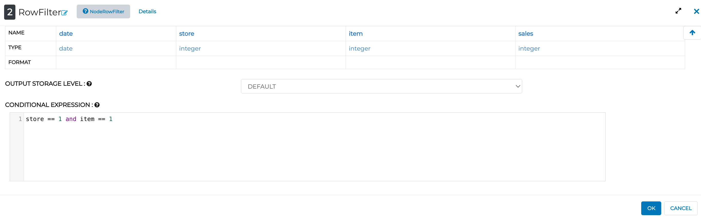
   
   
Node 3 - Prophet
++++++++++++++++

Used Facebook Prophet to create the ML model.

**General Section of Prophet Model**

* Set Date column in DS column field
* Y is the target variable. Set it to the Sales column
* Set Growth as linear or logistic
* We are using prophet model so it is sufficient to select seasonality in auto mode
* Set mode of seasonality as additive or multiplicative
* Set confidence Interval (0 to 1) which gives a range of plausible values for the parameter of interest.

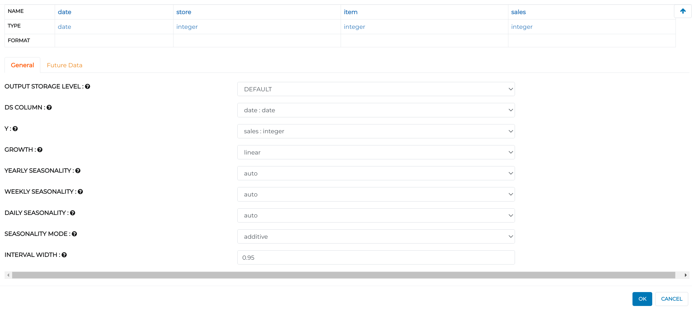

**Future Data section of Prophet model**

* FUTURE PERIOD block gives the number of steps we want to predict 
* FREQUENCY can be Monthly or Daily 
* Set INCLUDE HISTORY to true for testing the model and False for production
  
.. figure:: ../../_assets/tutorials/time-series/prophet_future.png
   :alt: Stock Forecasting
   :align: center
   :width: 60%

Node 4 - SQL
++++++++++++++++

**General Section of SQL node**

* Renames columns forecasted by Prophet  

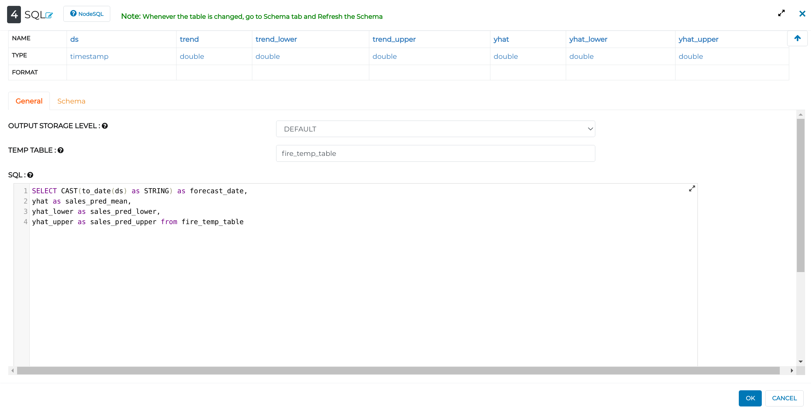

**Schema Section of SQL node**

* Refreshes Schema and sets data type with respect to columns

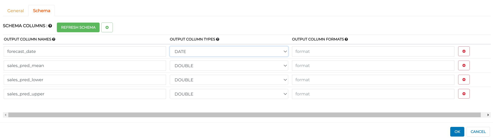
   

Node 5 - JoinUsingSQL
+++++++++++++++++++++

**General Section of JoinUsingSQL node**

* Joins Prediction (from SQL node) and Historical Data(from RowFilter node)

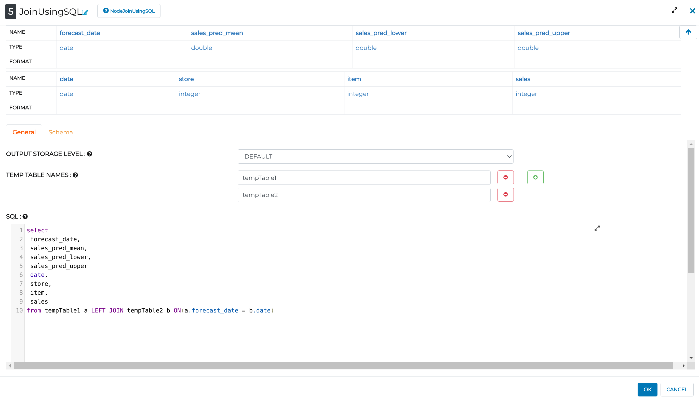

**Schema Section of JoinUsingSQL node**

* Follow the same steps as in Schema Section of SQL node

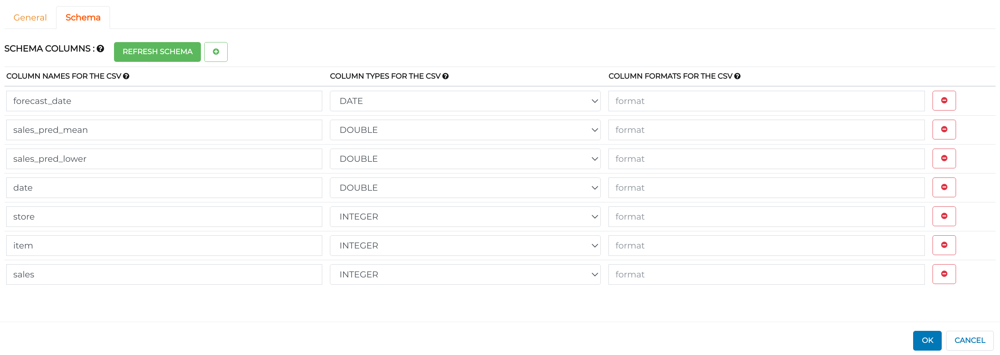

Node 6 - SaveCSV
++++++++++++++++

* Sets path where you want to save the final output

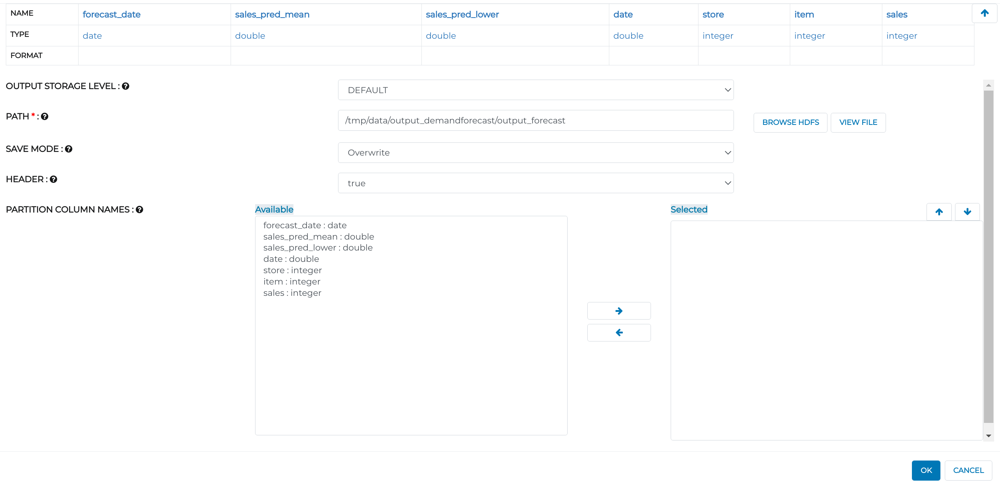

Output Visualization
---------------------

Graphical representation is the best way to understand insights from data. It refers to the use of charts and graphs to visually display, analyze, clarify, and interpret numerical data, functions and other qualitative structures.

Below is the workflow for Visualizing it:

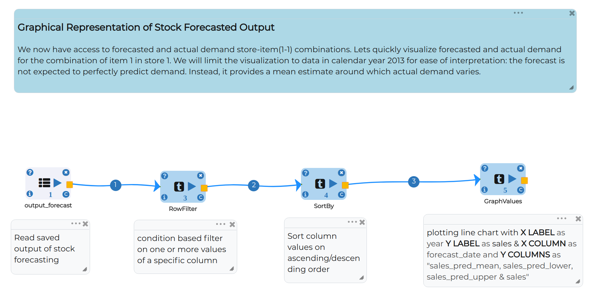

Node 1 - ReadCSV
++++++++++++++++

* Reads output CSV which we have saved from Stock Forecasting.

.. figure:: ../../_assets/tutorials/time-series/graph_readcsv.png
   :alt: Stock Forecasting
   :align: center
   :width: 60%

   
Node 2 - RowFilter
++++++++++++++++++

* Filters dataframe with categorical variables like store and item

   
Node 3 - SortBy
++++++++++++++++

* Gives options to sort our Dataset based on columns in ascending and descending order 
   
Node 4 - GraphValue
+++++++++++++++++++
* Defines labels for X-axis and Y-axis 
* Sets columns for X-axis and Y-axis

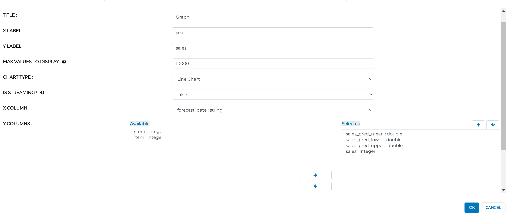
   
**Graph obtained**

* Sales_pred_mean - Blue line
* Sales_pred_lower - Red line
* Sales_pred_upper - Magenta line 
* Sales - Yellow line
* Now have a look into graph

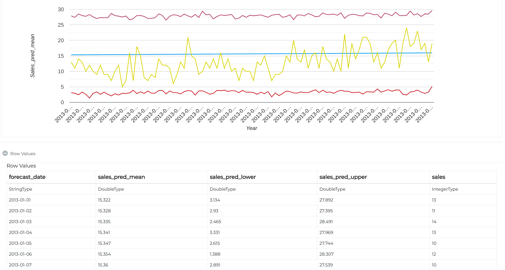
