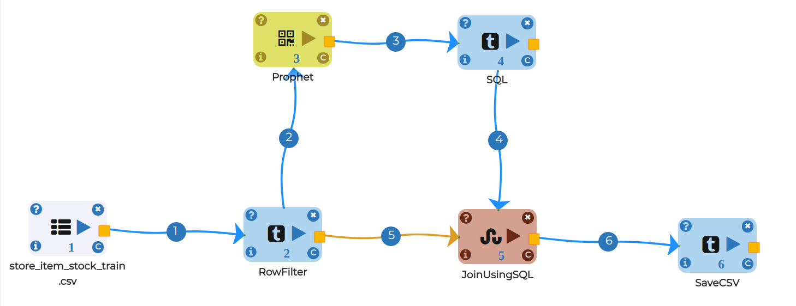

Stock Forecasting
=================

This workflow reads in a dataset. It then performs Prophet Time series modelling

Workflow
-------

* Reads data from a sample dataset.

.. figure:: ../../_assets/tutorials/time-series/read_csv.png
   :alt: Stock Forecasting
   :align: center
   :width: 60%

.. figure:: ../../_assets/tutorials/time-series/Row_filter.png
   :alt: Stock Forecasting
   :align: center
   :width: 60%

* Reads data from a sample dataset.

.. figure:: ../../_assets/tutorials/time-series/prophet_general.png
   :alt: Stock Forecasting
   :align: center
   :width: 60%
   
  
  
.. figure:: ../../_assets/tutorials/time-series/prophet_future.png
   :alt: Stock Forecasting
   :align: center
   :width: 60%

* Reads data from a sample dataset.

.. figure:: ../../_assets/tutorials/time-series/sql_general.png
   :alt: Stock Forecasting
   :align: center
   :width: 60%
   
   * Reads data from a sample dataset.

.. figure:: ../../_assets/tutorials/time-series/sql_schema.png
   :alt: Stock Forecasting
   :align: center
   :width: 60%
   
  
  
.. figure:: ../../_assets/tutorials/time-series/join_general.png
   :alt: Stock Forecasting
   :align: center
   :width: 60%

* Reads data from a sample dataset.

.. figure:: ../../_assets/tutorials/time-series/join_schema.png
   :alt: Stock Forecasting
   :align: center
   :width: 60%
   
   
.. figure:: ../../_assets/tutorials/time-series/save_output_forecast.png
   :alt: Stock Forecasting
   :align: center
   :width: 60%
