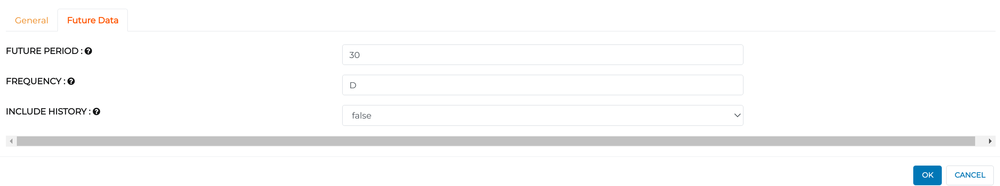

Stock Forecasting
=================

Objective
---------
Stock forecasting helps production units to get an idea about raw material, pricing of goods, improvement in supply chain management and proper control of sales.

Dataset
--------

Dataset contains 4 columns as below:-

.. list-table:: Read Structured Files Processors
   :widths: 30 70
   :header-rows: 1

   * - Title
     - Description
   * - Date
     - Date when product was sold.
   * - Store
     - Store ID from where product got sold.
   * - Item
     - Item ID.
   * - Sales
     - Quantity of product sold.

Predict future sales of items at a particular store.  

Prophet Time Series Modelling Workflow on Multivariate Data
-----------------------------------------------------------

Prophet is a procedure for forecasting time series data based on an additive model where non-linear trends fit with yearly, weekly, daily, seasonality and  holiday effects. It works best with time series that have strong seasonal effects and several seasons of historical data. Prophet is robust to missing data and shifts in the trend, and typically handles outliers well.

   .. figure:: ../../_assets/tutorials/time-series/stock_workflow1.png
      :alt: Stock Forecasting
      :width: 65%

Node 1 - ReadCSV
++++++++++++++++

* Reads the given CSV file : store_item_stock_train.csv

   .. figure:: ../../_assets/tutorials/time-series/read_csv.png
      :alt: Stock Forecasting
      :width: 70%

* Below are the first 10 rows of data.
* Columns contain data as datetype, store and item which are categorical variables and sales which is a continuous variable.

   .. figure:: ../../_assets/tutorials/time-series/store_top_10.png
      :alt: Stock Forecasting
      :width: 70%

Node 2 - RowFilter
++++++++++++++++++

* Filters data by row with respect to store and item.

   .. figure:: ../../_assets/tutorials/time-series/Row_filter.png
      :alt: Stock Forecasting
      :width: 70%
   
   
Node 3 - Prophet
++++++++++++++++

Uses Facebook Prophet to create the ML model.

**General Section of Prophet Model**

* Sets Date column in DS column field.
* Y is the target variable. Set it to the Sales column.
* Sets Growth as linear or logistic.
* We use prophet model so that it is sufficient to select seasonality in auto mode.
* Set mode of seasonality as additive or multiplicative.
* Set confidence Interval (0 to 1) which gives a range of possible values for the parameter of interest.

   .. figure:: ../../_assets/tutorials/time-series/prophet_general.png
      :alt: Stock Forecasting
      :width: 70%

**Future Data section of Prophet model**

* FUTURE PERIOD block gives the number of steps we want to predict. 
* FREQUENCY can be Monthly or Daily. 
* Set INCLUDE HISTORY to true for testing the model and false for production.
  

Node 4 - SQL
++++++++++++++++

**General Section of SQL node**

* Renames columns forecasted by Prophet. 

   .. figure:: ../../_assets/tutorials/time-series/sql_general.png
      :alt: Stock Forecasting
      :width: 70%

**Schema Section of SQL node**

* Refreshes Schema and sets data type with respect to columns.

   .. figure:: ../../_assets/tutorials/time-series/sql_schema.png
      :alt: Stock Forecasting
      :width: 70%
   

Node 5 - JoinUsingSQL
+++++++++++++++++++++

**General Section of JoinUsingSQL node**

* Joins Prediction (from SQL node) and Historical Data(from RowFilter node)

   .. figure:: ../../_assets/tutorials/time-series/join_general.png
      :alt: Stock Forecasting
      :width: 70%

**Schema Section of JoinUsingSQL node**

* Follow the same steps as in Schema Section of SQL Node

   .. figure:: ../../_assets/tutorials/time-series/join_schema.png
      :alt: Stock Forecasting
      :width: 70%

Node 6 - SaveCSV
++++++++++++++++

* Sets path where you want to save the final output.

   .. figure:: ../../_assets/tutorials/time-series/save_output_forecast.png
      :alt: Stock Forecasting
      :width: 70%
   
   
   
