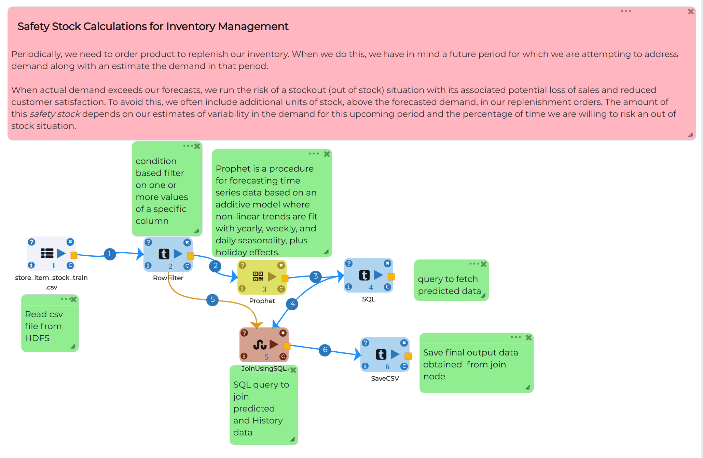
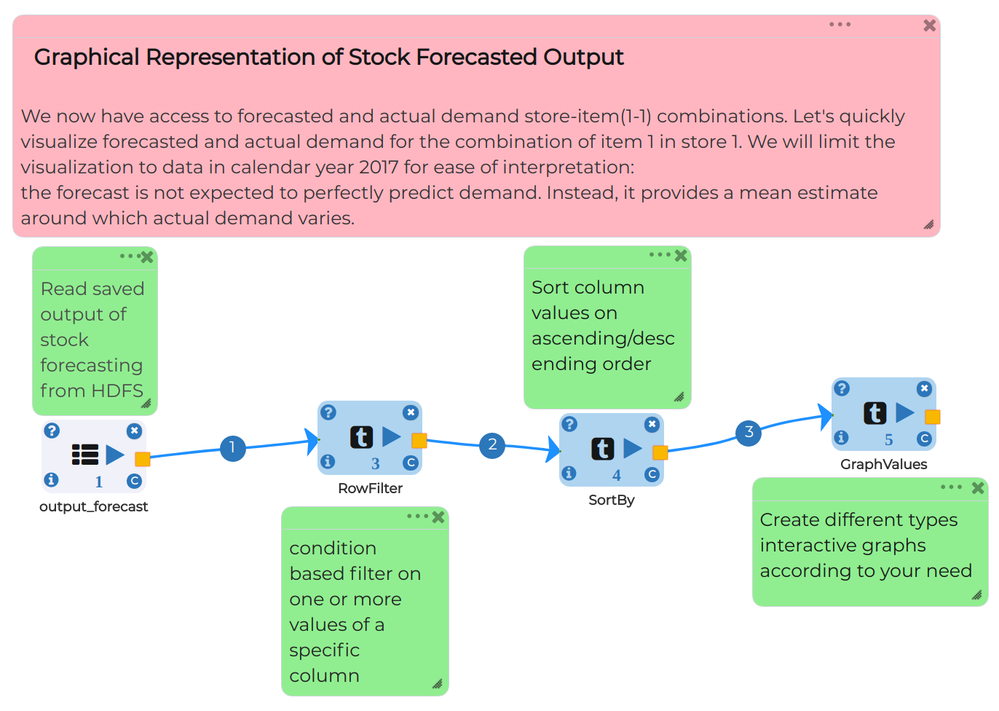

Stock Forecasting
=================

Objective
---------
Stock forecasting helps production units to get an idea about raw material, pricing of goods, improvement in supply-chain management and proper control of sales.

Dataset
--------

Data set contains 4 columns as follows:-

date - Product sold date

store - store id from where product get sold

item - what is the product id

sales - Quantity of product sold

Prophet Time Series Modelling Workflow on Multivariate Data
-----------------------------------------------------------

Prophet is a procedure for forecasting time series data based on an additive model where non-linear trends are fit with yearly, weekly, and daily seasonality, plus holiday effects. It works best with time series that have strong seasonal effects and several seasons of historical data. Prophet is robust to missing data and shifts in the trend, and typically handles outliers well.

Node 1 - ReadCSV
++++++++++++++++

* Read data from using Readcsv node by passing path

* click on browse HDFS and select store_item_stock_train dataset

* Select data type from COLUMN TYPES FOR THE CSV and click OK

.. figure:: ../../_assets/tutorials/time-series/read_csv.png
   :alt: Stock Forecasting
   :align: center
   :width: 60%

* Top 10 Rows of data
* Columns contains date as datetype, Store and Item are categorical variable and Sales as continuous variable

.. figure:: ../../_assets/tutorials/time-series/store_top_10.png
   :alt: Stock Forecasting
   :align: center
   :width: 60%

Node 2 - RowFilter
++++++++++++++++

* Filter data by row with respect to store and item

.. figure:: ../../_assets/tutorials/time-series/Row_filter.png
   :alt: Stock Forecasting
   :align: center
   :width: 60%
   
Node 3 - Prophet
++++++++++++++++

**General Section of Prophet model**

* Set Date column in DS column field
* Set Y as target here sales column is our target
* Set Growth as linear or Logistic
* We are using prophet model so that is self-sufficient to select seasonality in auto mode
* Select mode of seasonality as additive or multiplicative
* At last but not the least Provide Interval for the Forecast between 0 to 1

.. figure:: ../../_assets/tutorials/time-series/prophet_general.png
   :alt: Stock Forecasting
   :align: center
   :width: 60%

**Future Data section of Prophet model**

* In FUTURE PERIOD block give number of steps you want to predict 
* Give FREQUENCY as Monthly or Daily 
* INCLUDE HISTORY will true for testing our model and False for production
  
.. figure:: ../../_assets/tutorials/time-series/prophet_future.png
   :alt: Stock Forecasting
   :align: center
   :width: 60%

Node 4 - SQL
++++++++++++++++

**General Section of SQL node**

* Write SQL query to select required columns from temp table

.. figure:: ../../_assets/tutorials/time-series/sql_general.png
   :alt: Stock Forecasting
   :align: center
   :width: 60%

**Schema Section of SQL node**

* Refresh Schema and select give data type in OUTPUT COLUMN TYPES
* Click OK to save changes

.. figure:: ../../_assets/tutorials/time-series/sql_schema.png
   :alt: Stock Forecasting
   :align: center
   :width: 60%
   

Node 5 - JoinUsingSQL
++++++++++++++++

**General Section of JoinUsingSQL node**

* Write SQL query to join predicted(Data from SQL node) and History data(Data from RowFilter node)

.. figure:: ../../_assets/tutorials/time-series/join_general.png
   :alt: Stock Forecasting
   :align: center
   :width: 60%

**Schema Section of JoinUsingSQL node**

* Follow same step as in Schema Section of SQL node

.. figure:: ../../_assets/tutorials/time-series/join_schema.png
   :alt: Stock Forecasting
   :align: center
   :width: 60%

Node 6 - SaveCSV
++++++++++++++++

* click on browse HDFS select folder path where you want to save final output
* SAVE MODE block gives you flexibility of append, overwrite etc
* Set header preference as true or false
* PARTITION section gives you flexibility to select columns which you want to save

.. figure:: ../../_assets/tutorials/time-series/save_output_forecast.png
   :alt: Stock Forecasting
   :align: center
   :width: 60%

Output Visualization
---------------------

Graphical representation is best way to understand insights from data. It refers to the use of charts and graphs to visually display, analyze, clarify, and interpret numerical data, functions, and other qualitative structures.

Below is the workflow for Visualizing it:

Node 1 - ReadCSV
++++++++++++++++

* Read output csv which we have saved from Stock forecasting for Inventory Management
* click on browse HDFS and select output_forecast dataset
* Select data type from COLUMN TYPES FOR THE CSV and click OK

.. figure:: ../../_assets/tutorials/time-series/graph_readcsv.png
   :alt: Stock Forecasting
   :align: center
   :width: 60%

   
Node 2 - RowFilter
++++++++++++++++

* Filter dataframe with categorical variable like store and item

.. figure:: ../../_assets/tutorials/time-series/Row_filter.png
   :alt: Stock Forecasting
   :align: center
   :width: 60%
   
Node 3 - Sortby
++++++++++++++++

* Gives options to sort our data set based on columns as ascending and descending order 
   
Node 4 - GraphValue
++++++++++++++++

* TITLE - Give title to Graph
* LABELS - Define labels for X-axis and Y-axis 
* MAX VALUES TO DISPLAY - Maximum number of values want to plot into graph
* CHART TYPE - accourding to your requirement select chart type like line for continous variable, histogram for count of categorical variable etc.
* IS STREAMING - Define is your data is live streming or not as true or false 
* X COLUMN - Select column for X-axis which you want to represent as here Forecasted date on X-axis
* Y COLUMN - Select columns for Y-axis which you want to represent as here we represented sales_pred_mean, sales_pred_lower, sales_pred_upper, sales.

.. figure:: ../../_assets/tutorials/time-series/Graphvalues.png
   :alt: Stock Forecasting
   :align: center
   :width: 60%
   
**Now we reach on intresting part**

* sales_pred_mean - Blue line
* sales_pred_lower - Red line
* sales_pred_upper - Magenta line 
* sales - Yellow line
* In last you can also check what data we ploted on this graph 

.. figure:: ../../_assets/tutorials/time-series/Graph_output.png
   :alt: Stock Forecasting
   :align: center
   :width: 60%
