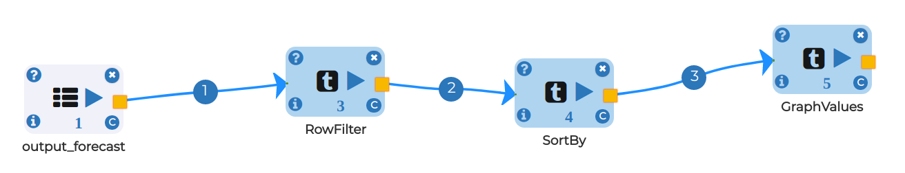

Stock Forecasted Output Visualization
=====================================

We now have access to forecasted and actual demand store-item(1-1) combinations. Let's quickly visualize forecasted and actual demand for the combination of item 1 in store 1. We will limit the visualization to data in calendar year 2013 for ease of interpretation:

* The forecast is not expected to perfectly predict demand. Instead, it provides a mean estimate around which actual demand varies.

Visualization workflow
-----------------------

Node 1 - ReadCSV
----------------

* Read output csv which we have saved from Stock forecasting for Inventory Management
* click on browse HDFS and select output_forecast dataset
* Select data type from COLUMN TYPES FOR THE CSV and click OK

.. figure:: ../../_assets/tutorials/time-series/graph_readcsv.png
   :alt: Stock Forecasting
   :align: center
   :width: 60%

   
Node 2 - RowFilter
------------------

* Filter dataframe with categorical variable like store and item

.. figure:: ../../_assets/tutorials/time-series/Row_filter.png
   :alt: Stock Forecasting
   :align: center
   :width: 60%
   
Node 3 - GraphValue
-------------------

* TITLE - Give title to Graph
* LABELS - Define labels for X-axis and Y-axis 
* MAX VALUES TO DISPLAY - Maximum number of values want to plot into graph
* CHART TYPE - accourding to your requirement select chart type like line for continous variable, histogram for count of categorical variable etc.
* IS STREAMING - Define is your data is live streming or not as true or false 
* X COLUMN - Select column for X-axis which you want to represent as here Forecasted date on X-axis
* Y COLUMN - Select columns for Y-axis which you want to represent as here we represented sales_pred_mean, sales_pred_lower, sales_pred_upper, sales.

.. figure:: ../../_assets/tutorials/time-series/Graphvalues.png
   :alt: Stock Forecasting
   :align: center
   :width: 60%
   
Now we reach on intresting part
-------------------------------

* sales_pred_mean - Blue line
* sales_pred_lower - Red line
* sales_pred_upper - Magenta line 
* sales - Yellow line
* In last you can also check what data we ploted on this graph 

.. figure:: ../../_assets/tutorials/time-series/Graph_output.png
   :alt: Stock Forecasting
   :align: center
   :width: 60%
