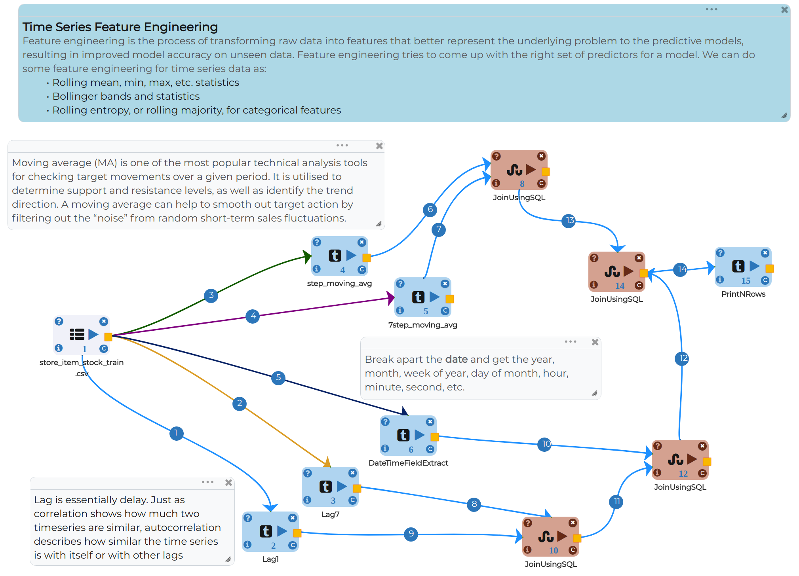

Time Series Feature Engineering
===============================

Objective
---------
Process of extracting new features from raw data via data mining techniques. These features can be used to improve the performance of models. 

Dataset
--------

Dataset contains 4 columns as below:

* Date - Date when product was sold
* Store - Store id from where product got sold
* Item - Item id
* Sales - Quantity of product sold

Feature Engineering Workflow
-----------------------------
Each column is a feature. But all features may not produce the best results from models, so feature engineering play important role in choosing the right features for a model won't just altogether improve its prescient force yet will likewise offer the adaptability to utilize less unpredictable models that are quicker to run and all the more handily.

Moving average
--------------
**One step moving average**

* Moving average are commonly used to streamline short-period fluctuations in time series data and feature long-term patterns.
* For one step window size will be from -1 to 1 for sales data

 .. figure:: ../../_assets/tutorials/time-series/ts_features/ma1.png
   :alt: Stock Forecasting
   :align: center
   :width: 100%

**Seven step moving average** 
 
* For one step window size will be from -7 to 7 for sales data
* Moving average output
 
 .. figure:: ../../_assets/tutorials/time-series/ts_features/moving_output.png
   :alt: Stock Forecasting
   :align: center
   :width: 100% 

Extract Date time features
--------------------------

* Break date and get the year, month, week of year, day of the month, hour, minute, second, etc.

 .. figure:: ../../_assets/tutorials/time-series/ts_features/date_field_extraction.png
   :alt: Stock Forecasting
   :align: center
   :width: 100% 

* Output of date time features

 .. figure:: ../../_assets/tutorials/time-series/ts_features/date_extrected_output.png
   :alt: Stock Forecasting
   :align: center
   :width: 100% 

Lags feature
------------

* Lag is used to make non-stationary data into stationary data
* Outliers are easily discernible on a lag plot
* acf and pacf plot is used to calcluate best lags

**Lag one**

* The most commonly used lag is 1, called a first-order lag
* Window shift is one

 .. figure:: ../../_assets/tutorials/time-series/ts_features/lag1.png
   :alt: Stock Forecasting
   :align: center
   :width: 100%

**Lag seven** 
 
* Window shift is seven
 
 .. figure:: ../../_assets/tutorials/time-series/ts_features/all_lags.png
   :alt: Stock Forecasting
   :align: center
   :width: 100% 
